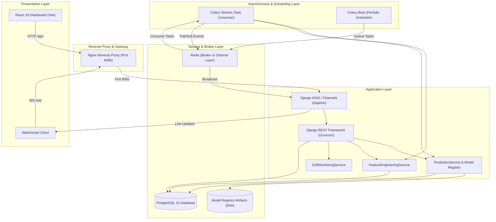

# Enterprise Stock Intelligence Platform

An enterprise-grade, production-ready quantitative finance and machine learning platform for real-time stock price direction forecasting, technical market intelligence, automated model monitoring, and data drift detection.

---

## 📑 Table of Contents

- [Overview](#overview)
- [Architecture](#architecture)
- [Key Features](#key-features)
- [Tech Stack](#tech-stack)
- [Repository Structure](#repository-structure)
- [Quickstart with Docker Compose](#quickstart-with-docker-compose)
- [Local Development Setup](#local-development-setup)
- [Environment Configuration](#environment-configuration)
- [Testing & Quality Assurance](#testing--quality-assurance)
- [Documentation Index](#documentation-index)
- [License](#license)

---

## 🚀 Overview

The **Enterprise Stock Intelligence Platform** delivers institutional-quality quantitative predictions and real-time market analytics for equities (e.g., `TCS.NS`, `RELIANCE.NS`, `INFY.NS`, `HDFCBANK.NS`). The system is architected around strict financial engineering principles:

- **No Lookahead Bias**: Time-series sequential splitting for feature preparation and model training.
- **Idempotent Ingestion & Inference**: Guaranteed deduplication across Celery polling intervals and prediction runs.
- **Production ML Monitoring**: Real-time Population Stability Index (PSI) data drift tracking, rolling accuracy metrics, and confusion matrix analytics.
- **Dual-Serving Delivery**: Low-latency REST APIs complemented by sub-second WebSocket event streams via Django Channels and Redis Pub/Sub.
- **Modern Fintech UI**: A light-themed, data-dense quantitative dashboard built with React 18, Tailwind CSS, and interactive financial charting.

---

## 🏛️ Architecture



For detailed system topology, data flows, and failure recovery specifications, see [docs/ARCHITECTURE.md](docs/ARCHITECTURE.md).

---

## ✨ Key Features

### 1. Market Data Ingestion & Technical Analytics
- Automated polling of real-time and historical market data via `MarketDataService` with resilient provider failover (`yfinance` provider with configurable production feeds).
- High-performance technical indicator engine calculating:
  - Moving Averages: SMA-10, SMA-20, SMA-50, EMA-12, EMA-26
  - Momentum & Trend: MACD (12, 26, 9), MACD Signal, MACD Histogram, RSI-14
  - Volatility & Volume: 20-day Rolling Volatility, 1-day Return, 5-day Return, Volume Change Percentage.
- Interactive multi-timeframe price charts (1D, 5D, 1M, 3M, 6M, 1Y) with OHLC Candlestick, Line, and Volume modes.

### 2. Machine Learning Inference & Model Registry
- **XGBoost Classifier**: Directional forecasting (probability of price moving `UP` vs. `DOWN` over the next trading interval).
- **Model Registry**: Strict versioning (`v1`, `v2`), artifact immutability, metadata validation, and zero-downtime model switching.
- **Explainability**: Top feature importance attribution (SHAP-compatible feature attribution rankings).

### 3. Production Model Monitoring & Data Drift
- **Population Stability Index (PSI)**: Quantifies covariate shift between baseline training distributions and live feature vectors.
  - $\text{PSI} < 0.1$: No Drift (Stable)
  - $0.1 \le \text{PSI} < 0.25$: Moderate Drift (Warning / Monitoring)
  - $\text{PSI} \ge 0.25$: Significant Drift (Retraining Recommended)
- **Live Accuracy & Outcome Resolution**: Celery tasks automatically evaluate past predictions against finalized market close prices (`CORRECT`, `INCORRECT`, `PENDING`).
- **Confusion Matrix & Classification Metrics**: Live calculation of Precision, Recall, F1-Score, and Balanced Accuracy.

### 4. Enterprise SaaS User Experience
- Sophisticated light fintech palette (`#F3F6FA` neutral background, elevated white cards, crisp financial typography).
- Responsive sidebar navigation with dedicated views: **Executive Dashboard**, **Stock Analysis**, **Prediction History**, and **Model Monitoring**.
- Resilient graceful degradation for unsupported or un-ingested tickers with zero data fabrication.

---

## 🛠️ Tech Stack

| Layer | Technology | Purpose |
|---|---|---|
| **Frontend** | React 18, TypeScript/JSX, Vite, Tailwind CSS | High-performance quantitative UI, responsive charts |
| **Backend** | Django 5.x, Django REST Framework (DRF) | Core API, domain services, security |
| **Realtime** | Django Channels, Daphne, Redis Channel Layer | Sub-second WebSocket pub/sub streaming |
| **Task Queue** | Celery 5.x, Celery Beat, Redis Broker | Market polling, inference tasks, resolution jobs |
| **Machine Learning** | XGBoost, Scikit-learn, Pandas, NumPy | Feature engineering, gradient boosted trees, drift math |
| **Database** | PostgreSQL 15 | Relational storage for stocks, prices, predictions |
| **Caching/Broker** | Redis 7 | Celery broker, result backend, Channels layer |
| **Proxy/Gateway** | Nginx | Reverse proxy, static asset serving, SSL termination |
| **Containerization** | Docker, Docker Compose | Reproducible multi-container orchestration |

---

## 📁 Repository Structure

```text
enterprise-stock-prediction/
├── backend/                        # Django backend application root
│   ├── config/                     # Django project settings, ASGI, WSGI, URLs, Celery
│   ├── market_data/                # Market ingestion, providers, technical indicators
│   ├── ml/                         # ML models, registry, training pipeline, inference
│   │   ├── inference/              # PredictionService, exceptions
│   │   ├── models/                 # ModelRegistry, training scripts
│   │   │   └── artifacts/          # Serialized .joblib and .json model metadata
│   ├── predictions/                # LivePredictionService, drift monitoring, REST views
│   ├── stocks/                     # Stock entities, exchange registries
│   ├── users/                      # Authentication and user accounts
│   ├── manage.py                   # Django CLI management script
│   └── requirements.txt            # Python production dependencies
├── frontend/                       # Vite + React 18 client application
│   ├── src/                        # Components, pages, hooks, services, state
│   ├── package.json                # Node.js dependencies
│   ├── vite.config.js              # Vite bundler configuration
│   └── Dockerfile                  # Multi-stage Nginx build for React
├── docs/                           # Comprehensive technical documentation
│   ├── ARCHITECTURE.md             # System architecture, topology, and recovery
│   ├── ML_PIPELINE.md              # Mathematical definitions, training, PSI drift
│   ├── API.md                      # REST API and WebSocket specifications
│   └── VIVA_GUIDE.md               # 25+ defense/viva questions and answers
├── docker-compose.yml              # Complete multi-service container orchestration
├── .env.example                    # Root environment configuration template
└── README.md                       # Main project documentation
```

---

## 🐳 Quickstart with Docker Compose

The simplest and recommended method to run the entire platform is via Docker Compose:

### 1. Clone & Configure Environment

```bash
git clone <repository_url>
cd enterprise-stock-prediction

# Copy environment templates
cp .env.example .env
cp backend/.env.example backend/.env
```

Review `.env` and set your preferred database credentials and secrets.

### 2. Launch Stack

```bash
docker compose up -d --build
```

This launches all 7 containers in detached mode:
- `stock_postgres` (Port 5433:5432)
- `stock_redis` (Port 6379:6379)
- `stock_backend` (Port 8000)
- `stock_celery_worker`
- `stock_celery_beat`
- `stock_frontend` (Internal Port 80)
- `stock_nginx` (Port 8080)

### 3. Run Database Migrations

```bash
docker compose exec backend python /app/backend/manage.py migrate
```

### 4. Seed Initial Stock & Model Data (Optional)

```bash
docker compose exec backend python /app/backend/manage.py init_stocks
```

### 5. Access the Platform

- **Web Dashboard**: [http://localhost:8080](http://localhost:8080)
- **REST API Health**: [http://localhost:8080/api/health/](http://localhost:8080/api/health/)
- **Live Prediction Endpoint**: [http://localhost:8080/api/predictions/TCS.NS/](http://localhost:8080/api/predictions/TCS.NS/)

---

## 💻 Local Development Setup

For local bare-metal development without Docker:

### Prerequisites
- Python 3.11+
- Node.js 18+ & npm
- PostgreSQL 15 running locally or via Docker
- Redis 7 running locally or via Docker

### Backend Setup

```bash
cd backend
python -m venv venv
source venv/bin/activate  # On Windows: venv\Scripts\activate
pip install -r requirements.txt

cp .env.example .env
# Edit .env with your local PostgreSQL and Redis connection strings

python manage.py migrate
python manage.py runserver 0.0.0.0:8000
```

### Celery Worker & Beat (Separate Terminals)

```bash
# Terminal 1: Worker
celery -A config worker --loglevel=info

# Terminal 2: Beat Scheduler
celery -A config beat --loglevel=info
```

### Frontend Setup

```bash
cd frontend
npm install
npm run dev
```

The frontend development server will launch at `http://localhost:5173`.

---

## ⚙️ Environment Configuration

| Variable | Default Value | Description |
|---|---|---|
| `DJANGO_SETTINGS_MODULE` | `config.settings` | Django settings module path |
| `SECRET_KEY` | `change_this_to_a_secure_random_key` | Django secret key for cryptographic signing |
| `DEBUG` | `False` | Enable/disable debug mode (must be `False` in prod) |
| `ALLOWED_HOSTS` | `localhost,127.0.0.1,nginx,backend` | Permitted HTTP host headers |
| `POSTGRES_DB` | `stock_prediction_db` | PostgreSQL database name |
| `POSTGRES_USER` | `stock_user` | PostgreSQL database user |
| `POSTGRES_PASSWORD` | `change_this_to_a_secure_password` | PostgreSQL database user password |
| `POSTGRES_HOST` | `postgres` | PostgreSQL host (`localhost` for local dev) |
| `POSTGRES_PORT` | `5432` | PostgreSQL internal port |
| `REDIS_URL` | `redis://redis:6379/0` | Redis connection URL for cache & channels |
| `CELERY_BROKER_URL` | `redis://redis:6379/1` | Redis connection URL for Celery broker |
| `CELERY_RESULT_BACKEND` | `redis://redis:6379/2` | Redis connection URL for Celery task results |
| `CORS_ALLOWED_ORIGINS` | `http://localhost:8080,http://localhost:3000` | Allowed Cross-Origin origins |

---

## 🧪 Testing & Quality Assurance

The platform features a rigorous 82-test automated suite covering unit tests, API integration tests, feature engineering edge cases, and Celery task idempotency.

### Running Backend Tests

To run the full test suite inside the Docker container:

```bash
docker compose exec backend python /app/backend/manage.py test market_data predictions stocks users --keepdb
```

Output:
```text
Found 82 test(s).
System check identified no issues (0 silenced).
----------------------------------------------------------------------
Ran 82 tests in 8.712s

OK
```

### Testing Idempotency & Failure Scenarios
- **Duplicate Prevention**: Testing repeated execution of prediction pipelines for identical market timestamps verifies that no duplicate rows are created in `predictions_prediction`.
- **Insufficient Data Guard**: Stocks with fewer than 50 historical price bars raise `InsufficientDataError` and gracefully return HTTP 422 without persisting invalid predictions.
- **Zero Leakage**: All API error responses strip internal stack traces and secrets.

---

## 📚 Documentation Index

| Document | Description |
|---|---|
| [docs/ARCHITECTURE.md](docs/ARCHITECTURE.md) | Multi-tier architecture, Celery workflows, WebSocket pipelines, and resilience |
| [docs/ML_PIPELINE.md](docs/ML_PIPELINE.md) | 12 technical features, XGBoost model architecture, training, and PSI drift math |
| [docs/API.md](docs/API.md) | REST API endpoints, request/response contracts, and WebSocket channels |
| [docs/VIVA_GUIDE.md](docs/VIVA_GUIDE.md) | 25+ viva / defense questions and answers on quant finance, ML, and architecture |

---

## 📄 License

This project is licensed under the MIT License. See `LICENSE` for details.

