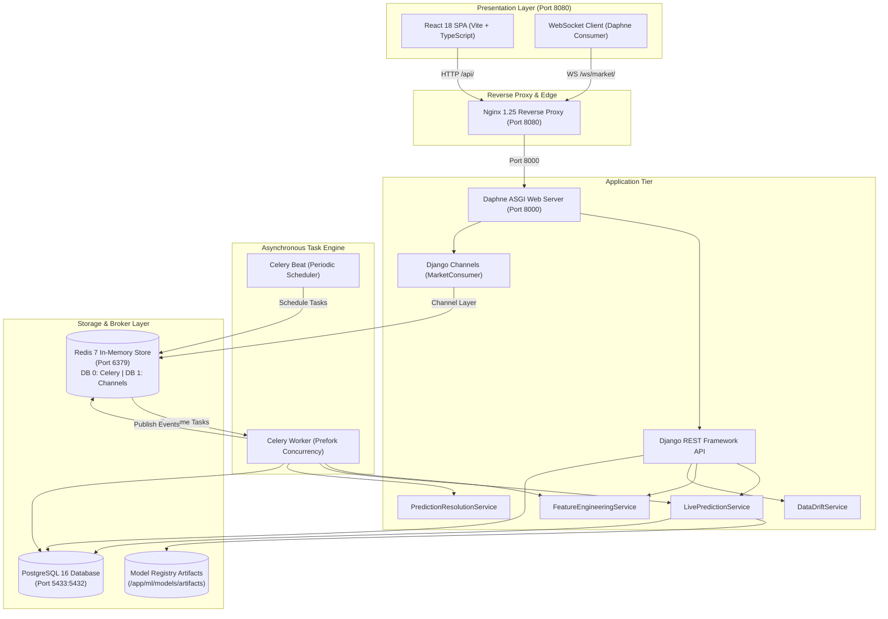

# MarketIQ — Enterprise Stock Price Prediction & Market Intelligence Platform

[-success?style=flat-square&logo=django)](docs/TESTING.md)
[](docs/TECH_STACK.md)
[](docs/TECH_STACK.md)
[](docs/TECH_STACK.md)
[](docs/TECH_STACK.md)
[](docs/DOCKER_DEPLOYMENT.md)
[](LICENSE)

An enterprise-grade, production-ready quantitative finance and machine learning platform for market-data ingestion, automated technical feature engineering, next-day stock price direction forecasting, interactive analytics, model governance, and data-quality monitoring.

> [!NOTE]
> **Academic & Defense Project**: Engineered for MCA final-year project demonstration, technical viva defense, and institutional evaluation. Implements strict financial data science standards with zero synthetic data fabrication.

---

## 📑 Table of Contents

- [Project Overview](#project-overview)
- [Key Features](#key-features)
- [System Architecture](#system-architecture)
- [Tech Stack](#tech-stack)
- [Repository Structure](#repository-structure)
- [Quickstart with Docker Compose](#quickstart-with-docker-compose)
- [Local Development Setup](#local-development-setup)
- [Environment Configuration](#environment-configuration)
- [API & WebSocket Summary](#api--websocket-summary)
- [Testing & Quality Assurance](#testing--quality-assurance)
- [Comprehensive Documentation Index](#comprehensive-documentation-index)
- [Ethical Financial Disclaimer](#ethical-financial-disclaimer)

---

## 🚀 Project Overview

**MarketIQ** is an institutional quantitative market intelligence application designed to forecast next-day equity directional price movements ($y_{t+1} \in \{\text{UP}, \text{DOWN}\}$) across 14 major National Stock Exchange of India (NSE) symbols across 7 key sectors:

- **Information Technology**: TCS (`TCS.NS`) [Trained], Infosys (`INFY.NS`) [Trained]
- **Energy & Conglomerate**: Reliance Industries (`RELIANCE.NS`) [Trained]
- **Financial Services**: HDFC Bank (`HDFCBANK.NS`) [Trained], ICICI Bank (`ICICIBANK.NS`), State Bank of India (`SBIN.NS`), Axis Bank (`AXISBANK.NS`), Kotak Mahindra Bank (`KOTAKBANK.NS`)
- **Industrial & Infrastructure**: Larsen & Toubro (`LT.NS`)
- **FMCG**: ITC Ltd. (`ITC.NS`), Hindustan Unilever (`HINDUNILVR.NS`)
- **Technology / Telecom**: Bharti Airtel (`BHARTIARTL.NS`)
- **Automobile**: Maruti Suzuki (`MARUTI.NS`)
- **Pharmaceutical**: Sun Pharma (`SUNPHARMA.NS`)

The platform is engineered around strict quantitative finance and data science principles:

1. **Zero Lookahead Bias**: Strict sequential time-series splitting for feature preparation and model training ($t \le T$).
2. **Deterministic Data Integrity**: Real market observations from PostgreSQL; missing observations return explicit `"Data unavailable"` indicators rather than synthetic or fabricated values.
3. **No Fabricated Predictions**: 4 core equities have calibrated production XGBoost models (`v1`), while the 10 newly added equities cleanly report `Model not yet trained for this stock` until trained via `python manage.py train_model --symbol <SYMBOL>`.
4. **End-to-End MLOps**: Continuous Population Stability Index (PSI) feature drift tracking, rolling accuracy evaluation, confusion matrix heatmaps, and probability calibration buckets.
5. **Dual-Serving Delivery**: Low-latency Django REST Framework endpoints (`/api/stocks/`, `/api/predictions/`, `/api/market-data/`) coupled with full-duplex WebSocket channel streams via Django Channels and Redis.
6. **Modern FinTech Light UI**: A high-density quantitative dashboard built with React 18, TypeScript, Recharts, and a calibrated `#F4F7FB` enterprise color system.

---

## ✨ Key Features

- **14 NSE Equities Supported**: Complete coverage across 7 major sectors with real-time stock search (by symbol, company name, or sector) and dynamic stock universe endpoint (`GET /api/stocks/`).
- **Market Intelligence AI Assistant**: Embedded quantitative explanation agent with controlled backend tools, dual-provider abstraction (OpenAI + deterministic offline fallback), context-aware financial education, and strict financial safety guardrails.
- **Automated Market Data Ingestion**: Automated polling of historical and real-time EOD OHLCV bars via `MarketDataService` with resilient network failover and retry logic.
- **12 Technical Indicators**: High-performance feature engineering calculating SMA (10, 20, 50), EMA (12, 26), MACD line & signal, RSI (14), 20-day rolling annualized volatility, 1D/5D returns, and volume changes.
- **XGBoost Directional Classification**: Gradient boosted decision tree classifiers trained on sequential market regimes with calibrated probability confidence.
- **Model Training CLI**: Train models for any supported equity on-demand with `python manage.py train_model --symbol <SYMBOL> [--promote]`.
- **Model Registry & Governance**: Complete lifecycle management tracking model versions (`candidate` &rarr; `staging` &rarr; `production` &rarr; `retired`), artifact checksums, and evaluation splits.
- **Prediction History & Auditing**: Auditable historical ledger recording every inference, prediction probabilities, 12-feature snapshots, realized market returns, and automated resolution (`CORRECT`, `INCORRECT`, `PENDING`).
- **Population Stability Index (PSI) Drift Monitoring**: Quantifies feature distribution divergence between reference baseline training sets and live production inference observations.
- **Data Quality & Hygiene Audit**: Automated validation rules matrix enforcing price continuity, timestamp monotonicity, non-negative volume, and outlier threshold constraints.
- **Subsystem Health Probes**: Real-time telemetry monitoring Daphne ASGI, PostgreSQL 16, Redis 7, Celery Worker, Celery Beat, and Model Artifact readiness.
- **Interactive Financial Visualizations**: Multi-timeframe price charts (`1D`, `5D`, `1M`, `3M`, `6M`, `1Y`), volume bars, RSI oscillators, MACD histograms, return distributions, and correlation heatmaps.

---

## 🏛️ System Architecture



For complete architectural specifications, see [docs/ARCHITECTURE.md](docs/ARCHITECTURE.md).

---

## 🛠️ Tech Stack

| Layer | Technologies | Description |
|---|---|---|
| **Backend Framework** | Django 5.1, Django REST Framework 3.15, Daphne 4.1 | Asynchronous ASGI REST API & WebSocket server |
| **Real-Time WebSockets** | Django Channels 4.1, channels-redis 4.3 | Sub-second market updates and prediction broadcasts |
| **Machine Learning** | XGBoost 2.1+, scikit-learn 1.5+, pandas 2.2+, numpy 2.0+ | Directional classification & feature engineering |
| **Asynchronous Engine** | Celery 5.4+, Celery Beat | Background ingestion, polling, and prediction resolution |
| **In-Memory Broker** | Redis 7 Alpine | Celery message broker (DB 0) & Channel Layer (DB 1) |
| **Relational Database** | PostgreSQL 16 Alpine, psycopg 3 | Relational time-series OHLCV, predictions, model registry |
| **Frontend Framework** | React 18.3, TypeScript 5.6, Vite 5.4 | High-performance Single Page Application (SPA) |
| **Visualizations** | Recharts 2.13, Lucide React 0.46 | Institutional financial charts & custom card tooltips |
| **Gateway & Proxy** | Nginx 1.25 Alpine | Reverse proxy, static asset delivery, SSL termination |
| **Orchestration** | Docker 24+, Docker Compose v2 | Multi-container isolated microservices architecture |

For complete dependency versions, see [docs/TECH_STACK.md](docs/TECH_STACK.md).

---

## 📁 Repository Structure

```
enterprise-stock-prediction/
├── backend/                      # Django ASGI/REST Backend Application
│   ├── config/                   # Project settings, URLs, Celery, ASGI/WSGI
│   ├── market_data/              # Ingestion services, models, tasks, consumers
│   ├── predictions/              # Prediction services, monitoring, drift, registry
│   ├── stocks/                   # Stock universe models & registration commands
│   ├── users/                    # Authentication application
│   └── manage.py                 # Django management script
├── frontend/                     # React 18 TypeScript SPA
│   ├── src/
│   │   ├── components/           # UI components (common, layout, charts, dashboard)
│   │   ├── pages/                # 9 standardized analytics pages
│   │   ├── services/             # Axios/fetch API client
│   │   ├── hooks/                # WebSocket hooks
│   │   └── types/                # TypeScript type definitions
│   ├── index.html                # HTML entry point with MarketIQ branding
│   ├── package.json              # Frontend dependencies
│   └── vite.config.ts            # Vite bundler configuration
├── ml/                           # Machine Learning Pipeline & Artifacts
│   ├── inference/                # PredictionService & exception definitions
│   ├── models/artifacts/         # Serialized .joblib models & .json metadata
│   └── training/                 # Offline training, cross-validation, evaluation
├── infrastructure/               # Docker & Gateway Infrastructure
│   ├── docker/                   # Backend Dockerfile & entrypoints
│   └── nginx/                    # Nginx reverse proxy configuration
├── docs/                         # Comprehensive Technical Documentation
│   ├── ARCHITECTURE.md           # Multi-tier system topology & data flows
│   ├── TECH_STACK.md             # Detailed technology stack breakdown
│   ├── MODULE_GUIDE.md           # Component-by-component codebase guide
│   ├── ML_PIPELINE.md            # Mathematics, features, and model training
│   ├── DATA_PIPELINE.md          # Ingestion, persistence, and feature store
│   ├── API.md                    # REST API & WebSocket specification
│   ├── DATABASE.md               # PostgreSQL schema & ER diagrams
│   ├── CELERY_REDIS.md           # Task queues, schedules, and brokers
│   ├── DOCKER_DEPLOYMENT.md      # Container orchestration & deployment
│   ├── FRONTEND.md               # UI/UX design system & component hierarchy
│   ├── TESTING.md                # Test suites & quality assurance
│   ├── MODEL_MONITORING.md       # PSI data drift & model health auditing
│   ├── PROJECT_WORKFLOW.md       # Step-by-step operational workflows
│   └── VIVA_GUIDE.md             # MCA defense questions & presentation script
├── docker-compose.yml            # Multi-container orchestration specification
├── requirements.txt              # Pinned Python backend dependencies
└── README.md                     # Main repository documentation
```

---

## ⚡ Quickstart with Docker Compose

### Prerequisites
- [Docker](https://docs.docker.com/get-docker/) (v24.0+)
- [Docker Compose](https://docs.docker.com/compose/install/) (v2.20+)

### 1. Clone the Repository & Configure Environment
```bash
git clone https://github.com/your-username/enterprise-stock-prediction.git
cd enterprise-stock-prediction

# Copy environment templates
cp .env.example .env
cp backend/.env.example backend/.env
```

### 2. Build & Launch Containers
```bash
docker compose up -d --build
```

### 3. Verify Container Health
```bash
docker compose ps
```
All 7 containers should report `Up` or `healthy`:
- `stock_nginx` (Port 8080)
- `stock_frontend` (Internal Port 80)
- `stock_backend` (Internal Port 8000)
- `stock_celery_worker` (Background daemon)
- `stock_celery_beat` (Scheduler daemon)
- `stock_postgres` (Port 5433:5432)
- `stock_redis` (Port 6379)

### 4. Access the Platform
- **Quantitative Dashboard**: [http://localhost:8080](http://localhost:8080)
- **Backend API Health**: [http://localhost:8080/api/health/](http://localhost:8080/api/health/)
- **Live Prediction Endpoint**: [http://localhost:8080/api/predictions/TCS.NS/](http://localhost:8080/api/predictions/TCS.NS/)

---

## 🧪 Testing & Quality Assurance

The platform features an automated test suite verifying market data ingestion, feature extraction, ML inference isolation, and REST API contracts:

```bash
docker compose exec -T backend python /app/backend/manage.py test market_data predictions stocks users ai_agent --keepdb
```

**Test Execution Output**:
```
Ran 97 tests in 4.091s

OK
Preserving test database for alias 'default'...
```
- **Total Tests**: **97 / 97 passing (100% pass rate, 0 failures, 0 errors)**.
- **Frontend Build**: Verified with zero TypeScript compiler (`tsc`) errors and zero Vite bundle warnings.

For testing methodology and test case descriptions, see [docs/TESTING.md](docs/TESTING.md).

---

## 📚 Comprehensive Documentation Index

Explore the complete technical documentation suite:

| Document | Description |
|---|---|
| **[AI_AGENT.md](docs/AI_AGENT.md)** | Market Intelligence Assistant architecture, tools, safety, and providers |
| **[ARCHITECTURE.md](docs/ARCHITECTURE.md)** | System topology, sequence diagrams, and fault-tolerance mechanics |
| **[TECH_STACK.md](docs/TECH_STACK.md)** | Comprehensive technology stack breakdown and dependency catalog |
| **[MODULE_GUIDE.md](docs/MODULE_GUIDE.md)** | File-by-file codebase guide across backend, frontend, and ML |
| **[ML_PIPELINE.md](docs/ML_PIPELINE.md)** | Mathematical formulas, 12 features, XGBoost training, and metrics |
| **[DATA_PIPELINE.md](docs/DATA_PIPELINE.md)** | Ingestion lifecycle, PostgreSQL schema, and feature store |
| **[API.md](docs/API.md)** | Complete OpenAPI/REST and WebSocket specification with schemas |
| **[DATABASE.md](docs/DATABASE.md)** | PostgreSQL relational schema, constraints, and ER diagrams |
| **[CELERY_REDIS.md](docs/CELERY_REDIS.md)** | Asynchronous tasks, schedules, exponential retries, and broker setup |
| **[DOCKER_DEPLOYMENT.md](docs/DOCKER_DEPLOYMENT.md)** | Container orchestration, volume persistence, and networking |
| **[FRONTEND.md](docs/FRONTEND.md)** | React 18 UI/UX architecture, design tokens, and components |
| **[TESTING.md](docs/TESTING.md)** | Unit, integration, and regression test suites with coverage details |
| **[MODEL_MONITORING.md](docs/MODEL_MONITORING.md)** | Population Stability Index (PSI), drift thresholds, and health probes |
| **[PROJECT_WORKFLOW.md](docs/PROJECT_WORKFLOW.md)** | Operational workflows from data ingestion to outcome resolution |
| **[VIVA_GUIDE.md](docs/VIVA_GUIDE.md)** | MCA project defense questions, model answers, and viva script |

---

## ⚖️ Ethical Financial Disclaimer

> [!WARNING]
> **Educational & Research Use Only**: This software is engineered strictly for educational, academic, and demonstration purposes as part of an MCA final-year project. Stock market trading involves substantial risk of loss. The directional predictions generated by the machine learning models are probabilistic estimates ($t+1$) and **do not constitute financial advice, investment recommendations, or trading signals**. Neither the authors nor contributors accept any liability for financial decisions made using this application.
