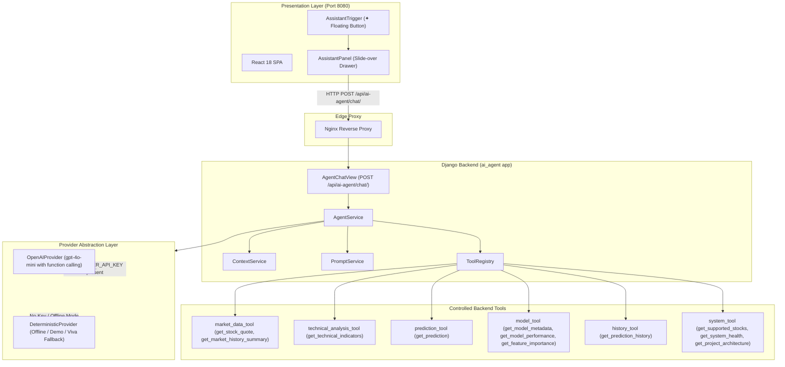

# Market Intelligence Assistant — Technical Documentation

This document provides complete technical specifications for the **Market Intelligence Assistant** in **MarketIQ**, covering system architecture, controlled tool-calling mechanics, provider abstraction, context awareness, financial safety boundaries, and testing protocols.

---

## 📑 Table of Contents

- [Overview & Ethical Purpose](#overview--ethical-purpose)
- [System Architecture](#system-architecture)
- [Controlled Tool-Calling Mechanics](#controlled-tool-calling-mechanics)
- [Provider Abstraction (Dual Serving Strategy)](#provider-abstraction-dual-serving-strategy)
- [Context Awareness & Session State](#context-awareness--session-state)
- [System Prompt & Grounding Rules](#system-prompt--grounding-rules)
- [Financial Safety & Compliance Boundaries](#financial-safety--compliance-boundaries)
- [REST API Specification](#rest-api-specification)
- [Frontend User Experience](#frontend-user-experience)
- [Security & Rate Limiting](#security--rate-limiting)
- [Testing & Quality Assurance](#testing--quality-assurance)
- [Extensibility & Future Capabilities](#extensibility--future-capabilities)

---

## ✦ Overview & Ethical Purpose

The **Market Intelligence Assistant** is an AI-powered quantitative explanation assistant built directly into the MarketIQ platform. It serves as an intelligent bridge between complex quantitative data science models and end users (equity analysts, students, evaluators, and faculty).

### Primary Capabilities:
1. **Explain Market Data**: Decodes real-time and historical OHLCV quotes, volume metrics, and intraday price dynamics.
2. **Explain 12 Technical Indicators**: Translates mathematical indicators (RSI-14, SMA 10/20/50, EMA 12/26, MACD line/signal, 20-day annualized volatility) into intuitive financial concepts.
3. **Explain XGBoost Predictions**: Details next-day directional forecasts ($y_{t+1} \in \{\text{UP}, \text{DOWN}\}$), model confidence probabilities, and underlying feature attributions.
4. **Explain Model Governance & MLOps**: Interrogates evaluation metrics (accuracy, precision, recall, F1, ROC-AUC), confusion matrices, and Population Stability Index (PSI) feature drift.
5. **Auditable History**: Summarizes past prediction records and their EOD realization outcomes (`CORRECT`, `INCORRECT`, `PENDING`).
6. **Platform Education & Navigation**: Explains full-stack architecture (Django, React, Redis, Celery, PostgreSQL) and guides users to specific dashboard sections.

### Ethical Boundaries:
- **Explanation Only**: Strictly prohibited from executing trades, placing market orders, or providing investment advice.
- **Zero Hallucination**: Never fabricates prices, dates, or model metrics. All responses are strictly grounded in live database queries via controlled tools.
- **Untrained Equities**: For the 10 untrained NSE equities, explicitly reports that no model is available and provides instructions for the CLI training command (`python manage.py train_model --symbol <SYMBOL> --promote`).

---

## 🏛️ System Architecture



---

## 🛠️ Controlled Tool-Calling Mechanics

To prevent LLM hallucinations and eliminate direct database access risks, the assistant interacts with backend data solely through a registered suite of 11 tools:

| Tool Name | Parameters | Source Service | Description |
|---|---|---|---|
| `get_stock_quote` | `symbol` | `MarketPrice` | Latest OHLCV bar, timestamp, daily change, and % change |
| `get_market_history_summary` | `symbol`, `limit` | `MarketPrice` | High, low, average volume, and net return over recent sessions |
| `get_technical_indicators` | `symbol` | `FeatureEngineeringService` | 12 technical features (RSI-14, SMAs, EMAs, MACD, volatility) |
| `get_prediction` | `symbol` | `PredictionService` / `Prediction` | Direction (UP/DOWN), confidence %, class probabilities |
| `get_model_metadata` | `symbol` | `ModelRegistry` / `_metadata.json` | Model version, features used, evaluation metrics |
| `get_model_performance` | `symbol` | `ModelMonitoringService` | Rolling accuracy %, confusion matrix, precision, recall |
| `get_feature_importance` | `symbol` | `ModelRegistry` / XGBoost | Ranked feature gain importances across decision trees |
| `get_prediction_history` | `symbol`, `limit` | `Prediction` | Historical prediction audits and EOD realization outcomes |
| `get_supported_stocks` | *none* | `stocks.universe` | List of all 14 NSE equities, sectors, and trained status |
| `get_system_health` | *none* | `django.db`, `redis`, artifacts | Operational status of API, DB, Redis, Celery, Registry |
| `get_project_architecture` | *none* | System Configuration | Full-stack technology breakdown for educational queries |

---

## 🔌 Provider Abstraction (Dual Serving Strategy)

The platform implements an extensible provider interface (`BaseLLMProvider`) designed for high availability:

1. **`OpenAIProvider`**:
   - Leverages OpenAI's Chat Completions API with native tool/function calling.
   - Automatically executes requested tools and passes serialized outputs back for natural language synthesis.
2. **`DeterministicProvider`**:
   - A deterministic, rule- and template-based reasoning engine.
   - Parses intent, executes the exact same tools from `ToolRegistry` against real database records, and formats rich quantitative answers.
   - **Guarantees zero-dependency operation**: Works 100% offline during academic defenses, viva presentations, automated tests, or environments without an active API key.

---

## 🧭 Context Awareness & Session State

The assistant maintains continuous awareness of the user's active session:
- **Active Stock Symbol**: Automatically injected into prompts (e.g. `TCS.NS`, `ICICIBANK.NS`).
- **Context Switching**: Switching stocks in the top selector updates the assistant's state, notifying the user and re-grounding follow-up questions.
- **Active Page**: Understands whether the user is on the Dashboard, Stock Analysis, Predictions, Model Analytics, Prediction History, Data Quality, or System Health.
- **Short-Term Memory**: Preserves the last 10 conversation turns to resolve pronouns (e.g., "What is the prediction for TCS?" followed by "Why?").

---

## 🛡️ Financial Safety & Compliance Boundaries

The assistant implements strict ethical and legal guardrails:
1. **Refusal of Financial Advice**:
   - User: *"Should I buy TCS today?"*
   - Assistant: *"I can explain the available market data, technical indicators, model prediction, and historical performance for Tata Consultancy Services Ltd. (TCS.NS), but I cannot provide buy or sell recommendations."*
2. **Standard Risk Disclaimer**:
   - Appends a compliance notice: *"Directional machine learning forecasts represent probabilistic estimates ($t+1$) and do not constitute financial advice. All investments carry risk of loss."*
3. **No Synthetic Predictions**:
   - For untrained stocks, never borrows weights or fabricates outputs. Instead, returns: *"There is currently no trained machine learning model artifact for ICICIBANK.NS..."*

---

## 📡 REST API Specification

### Endpoint: `POST /api/ai-agent/chat/`

#### Request Payload
```json
{
  "message": "Why is TCS predicted UP?",
  "symbol": "TCS.NS",
  "page": "dashboard",
  "conversation_history": [
    {"sender": "user", "text": "What is the prediction for TCS?"},
    {"sender": "assistant", "text": "The model predicts UP with 54.4% confidence."}
  ]
}
```

#### Response Payload (HTTP 200)
```json
{
  "response": "**Next-Day Directional Forecast for Tata Consultancy Services Ltd. (TCS.NS)**\n\n- Predicted Direction: **UP**\n- Model Confidence: **54.4%**\n...",
  "symbol": "TCS.NS",
  "tools_used": ["get_prediction", "get_technical_indicators"],
  "citations": ["Prediction Model", "Technical Indicators"],
  "suggested_questions": [
    "What is the historical accuracy for TCS.NS?",
    "Explain the RSI for TCS.NS",
    "What features are most important to the model?"
  ],
  "execution_time_ms": 26.27
}
```

---

## 🔒 Security & Rate Limiting

1. **API Key Isolation**:
   - `AI_PROVIDER_API_KEY` is loaded strictly on the backend via environment variables.
   - It is never exposed to the frontend, browser local storage, or Git repositories.
2. **Endpoint Throttling**:
   - Sliding-window cache rate limiting restricts requests to 60 requests per minute per client IP, preventing denial-of-service and accidental client loops.
3. **Input Sanitization**:
   - Enforces 2,000-character limits and alphanumeric symbol filtering to mitigate prompt injection attacks.

---

## 🧪 Testing & Quality Assurance

The `ai_agent` module includes 14 comprehensive unit and integration tests:

```bash
docker compose exec -T backend python /app/backend/manage.py test ai_agent --keepdb
```

### Test Coverage:
- `test_tool_registry_completeness`: Validates all 11 tools have valid callable schemas.
- `test_market_data_tool`: Validates quote retrieval and historical summaries.
- `test_technical_indicators_tool`: Validates 12-feature indicator computations.
- `test_prediction_tool_trained_vs_untrained`: Validates pre-trained predictions vs. clean `model_not_found` error handling.
- `test_financial_advice_guardrail`: Validates that buy/sell queries trigger neutrality and disclaimer.
- `test_api_chat_endpoint_success`: Validates REST API serialization and latency logging.
- `test_api_chat_empty_message_rejected`: Validates input validation error handling.

---

## 🚀 Extensibility & Future Capabilities

The `ToolRegistry` and `BaseLLMProvider` abstractions allow seamless expansion:
- **Portfolio Analytics**: Integrating portfolio allocation and Sharpe ratio calculations.
- **News Sentiment Analysis**: Integrating financial news feeds with sentiment scoring.
- **Custom Model Comparison**: Side-by-side LLM explanation comparing XGBoost vs. LSTM models.

