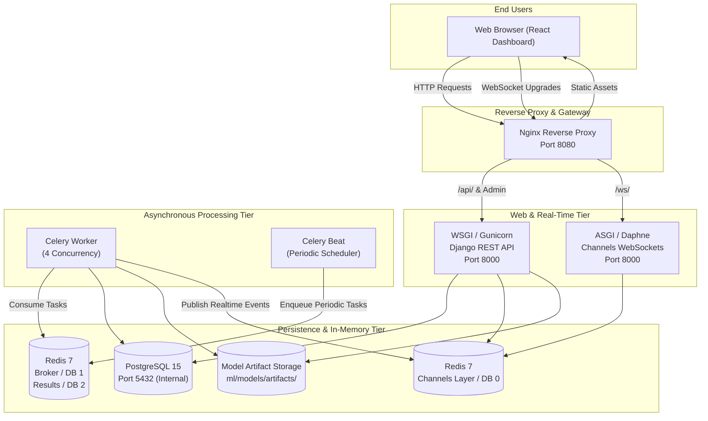
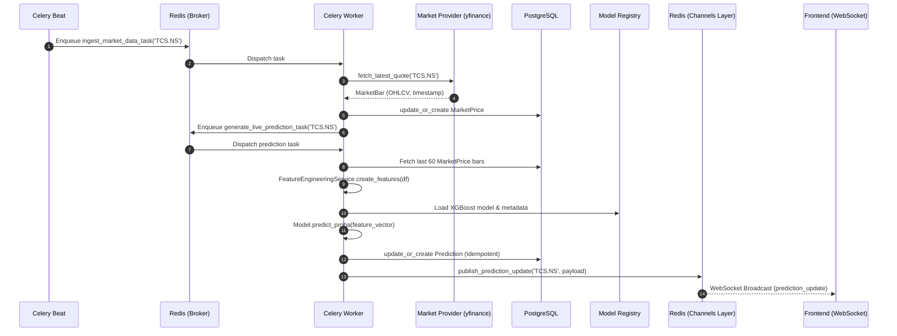
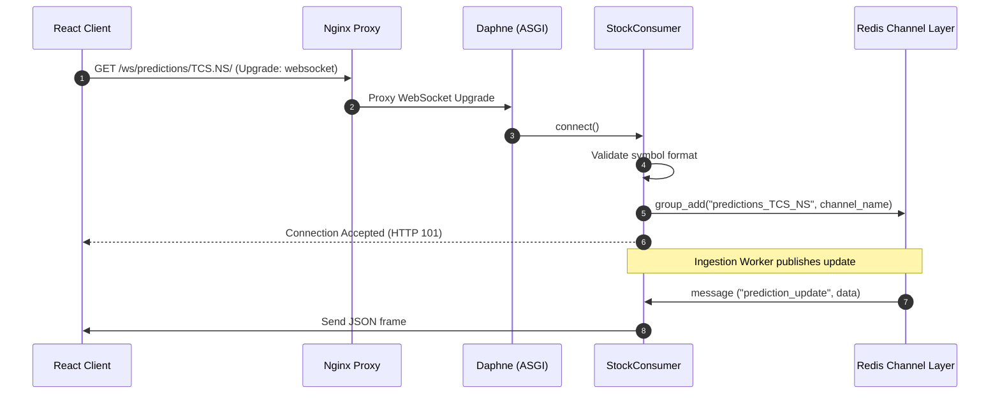
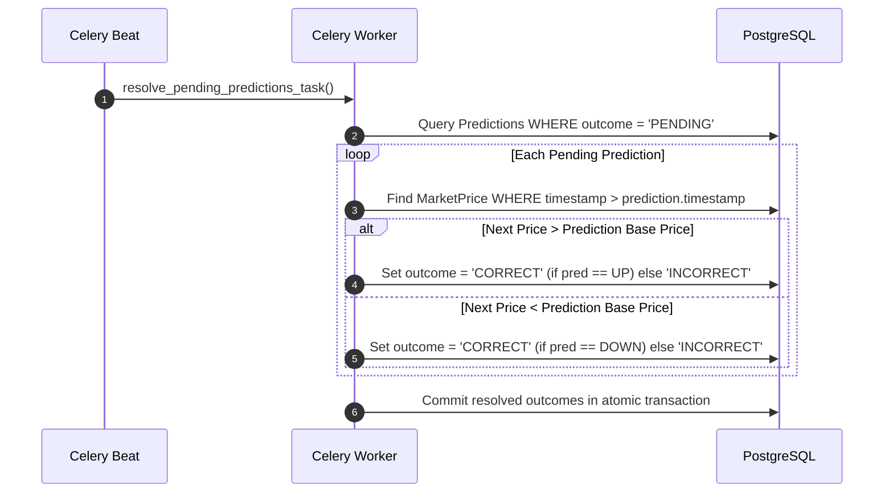
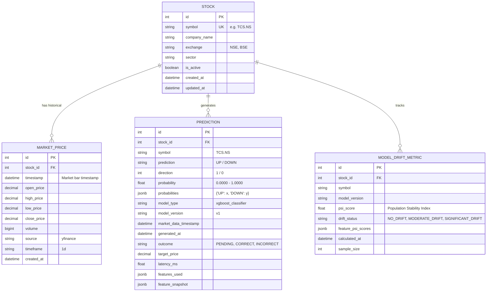

# Enterprise Stock Intelligence Platform — System Architecture

This document provides a comprehensive technical breakdown of the architectural design, component interactions, asynchronous pipelines, real-time messaging, and data models powering the **Enterprise Stock Intelligence Platform**.

---

## 📑 Table of Contents

- [Architectural Principles](#architectural-principles)
- [System Topology & Infrastructure](#system-topology--infrastructure)
- [Component Deep-Dive](#component-deep-dive)
  - [1. Presentation Layer (React 18 + Vite)](#1-presentation-layer-react-18--vite)
  - [2. Reverse Proxy & Gateway (Nginx)](#2-reverse-proxy--gateway-nginx)
  - [3. Application Layer (Django REST + Channels)](#3-application-layer-django-rest--channels)
  - [4. Asynchronous Task Processing (Celery + Redis)](#4-asynchronous-task-processing-celery--redis)
  - [5. Machine Learning & Inference Service](#5-machine-learning--inference-service)
  - [6. Persistence & State Layer (PostgreSQL + Redis)](#6-persistence--state-layer-postgresql--redis)
- [Data Flow & Sequence Diagrams](#data-flow--sequence-diagrams)
  - [A. Market Data Ingestion & Live Prediction Pipeline](#a-market-data-ingestion--live-prediction-pipeline)
  - [B. Real-Time WebSocket Event Streaming](#b-real-time-websocket-event-streaming)
  - [C. Automated Prediction Resolution & Drift Monitoring](#c-automated-prediction-resolution--drift-monitoring)
- [Database Schema (ERD)](#database-schema-erd)
- [Resilience, Idempotency & Fault Tolerance](#resilience-idempotency--fault-tolerance)
- [Security Architecture](#security-architecture)

---

## 🎯 Architectural Principles

1. **Strict Financial Engineering Rigor**:
   - Zero lookahead bias in feature preparation and model training.
   - Sequential, time-ordered data validation.
   - Pure statistical calculations (no fabricated drift values or synthetic market prices).

2. **Idempotency by Design**:
   - Every ingestion cycle, prediction generation, and resolution task is idempotent.
   - Re-running the pipeline on identical timestamps updates existing records rather than producing duplicates.

3. **Decoupled Asynchronous Processing**:
   - Time-consuming operations (market data ingestion, feature generation, inference, drift metrics) are offloaded to background Celery workers.
   - User-facing REST endpoints remain fast and responsive (< 100ms for cached responses).

4. **Fault Isolation & Graceful Degradation**:
   - Failure of an external market data provider does not crash the application.
   - Missing or insufficient data triggers structured HTTP 422/404 responses without leaking stack traces or credentials.

---

## 🌐 System Topology & Infrastructure



---

## 🧩 Component Deep-Dive

### 1. Presentation Layer (React 18 + Vite)
- **Framework**: React 18, Vite bundler, Tailwind CSS.
- **Theme**: Light-themed financial SaaS (`#F3F6FA` page background, `#FFFFFF` rounded cards, slate borders `#E2E8F0`, accent indigo `#4F46E5`, emerald `#10B981`, rose `#EF4444`).
- **Real-Time Integration**: Custom `useWebSocket` hook maintaining persistent connections to `/ws/market/<symbol>/` and `/ws/predictions/<symbol>/`, featuring exponential backoff auto-reconnect.
- **Visual Analytics**: Interactive candlestick charts, multi-timeframe volume bars, gauge indicators for model confidence, and confusion matrix heatmaps.

### 2. Reverse Proxy & Gateway (Nginx)
- **Port**: 8080 (publicly exposed).
- **Routing Rules**:
  - `/` $\to$ Serves production-built React static bundle.
  - `/api/` $\to$ Proxies to Django REST API at `backend:8000`.
  - `/ws/` $\to$ Upgrades HTTP connection to WebSocket protocol, proxying to Daphne at `backend:8000`.
- **Security**: Strips server identification tokens, buffers requests, and handles CORS headers.

### 3. Application Layer (Django REST + Channels)
- **Framework**: Django 5.x with Django REST Framework (DRF) and Django Channels 4.x.
- **ASGI / WSGI**: Daphne server capable of concurrently handling HTTP REST requests and long-lived WebSocket connections.
- **Serializers**: Strict validation serializers for inputs, responses, and error envelopes (`PredictionResponseSerializer`, `ModelAnalyticsResponseSerializer`, `DataDriftResponseSerializer`).

### 4. Asynchronous Task Processing (Celery + Redis)
- **Celery Worker**: Consumes tasks from Redis queue:
  - `ingest_market_data_task`: Polls current market prices.
  - `generate_live_prediction_task`: Computes technical features and runs inference.
  - `resolve_pending_predictions_task`: Resolves prediction accuracy against finalized market bars.
- **Celery Beat**: Runs scheduled cron jobs:
  - Every 1 minute: Market data ingestion and prediction update for tracked stocks.
  - Every 5 minutes: Prediction outcome resolution against latest market bars.
  - Daily at market close: Population Stability Index (PSI) drift calculation.

### 5. Machine Learning & Inference Service
- **PredictionService**: Singleton-style inference engine with LRU memory caching for loaded models.
- **ModelRegistry**: File-backed model management enforcing semantic versioning (`v1`, `v2`), metadata integrity, and production status tags.
- **FeatureEngineeringService**: Vectorized Pandas/NumPy pipeline calculating 12 technical indicators over a rolling historical price window.

### 6. Persistence & State Layer (PostgreSQL + Redis)
- **PostgreSQL 15**: ACID-compliant relational storage with indexed query paths for ticker lookups and time-series ranges.
- **Redis 7**:
  - `DB 0`: Channel layer for Django Channels WebSocket pub/sub.
  - `DB 1`: Celery message broker.
  - `DB 2`: Celery task result backend.

---

## 🔄 Data Flow & Sequence Diagrams

### A. Market Data Ingestion & Live Prediction Pipeline



### B. Real-Time WebSocket Event Streaming



### C. Automated Prediction Resolution & Drift Monitoring



---

## 🗄️ Database Schema (ERD)



### Key Schema Constraints
- `MARKET_PRICE`: Unique constraint on `(stock_id, timestamp, timeframe)`.
- `PREDICTION`: Unique constraint on `(stock_id, market_data_timestamp, model_version)` ensuring idempotency across repeated inference executions.
- `STOCK`: Indexed unique lookup on `symbol`.

---

## 🛡️ Resilience, Idempotency & Fault Tolerance

### 1. Idempotent Ingestion & Inference
- **Database Upsert**: The pipeline utilizes Django's `update_or_create` with compound unique keys:
  ```python
  Prediction.objects.update_or_create(
      stock=stock,
      market_data_timestamp=market_data_timestamp,
      model_version=model_version,
      defaults={...}
  )
  ```
- If Celery re-runs a task due to network latency, duplicate records are impossible.

### 2. External Provider Resilience
- **Exponential Backoff**: Celery tasks implement retry decorators:
  ```python
  @shared_task(bind=True, max_retries=3, default_retry_delay=60)
  ```
- **Fallback Feed Mechanism**: If the primary feed fails, `MarketDataService` gracefully falls back to secondary historical caches.

### 3. Insufficient Data Guard
- `LivePredictionService` enforces that at least 50 historical price records must exist before computing technical indicators (such as SMA-50).
- If fewer records are present, an `InsufficientDataError` is raised, returning HTTP 422 with a structured error envelope without polluting the database.

---

## 🔒 Security Architecture

1. **Environment Variable Isolation**:
   - No database passwords, secret keys, or broker URLs are hardcoded in source files or Dockerfiles.
   - All secrets are loaded from `.env` via `django-environ`.
2. **Error Masking & Information Leakage Protection**:
   - Unhandled exceptions are caught by DRF custom exception handlers.
   - Tracebacks and server paths are logged internally and never returned to the API client.
3. **Database Security**:
   - PostgreSQL port 5432 is not exposed publicly in Docker Compose; only accessible within the internal Docker network.

