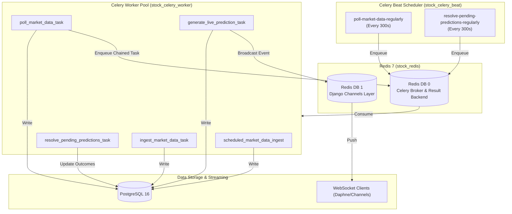
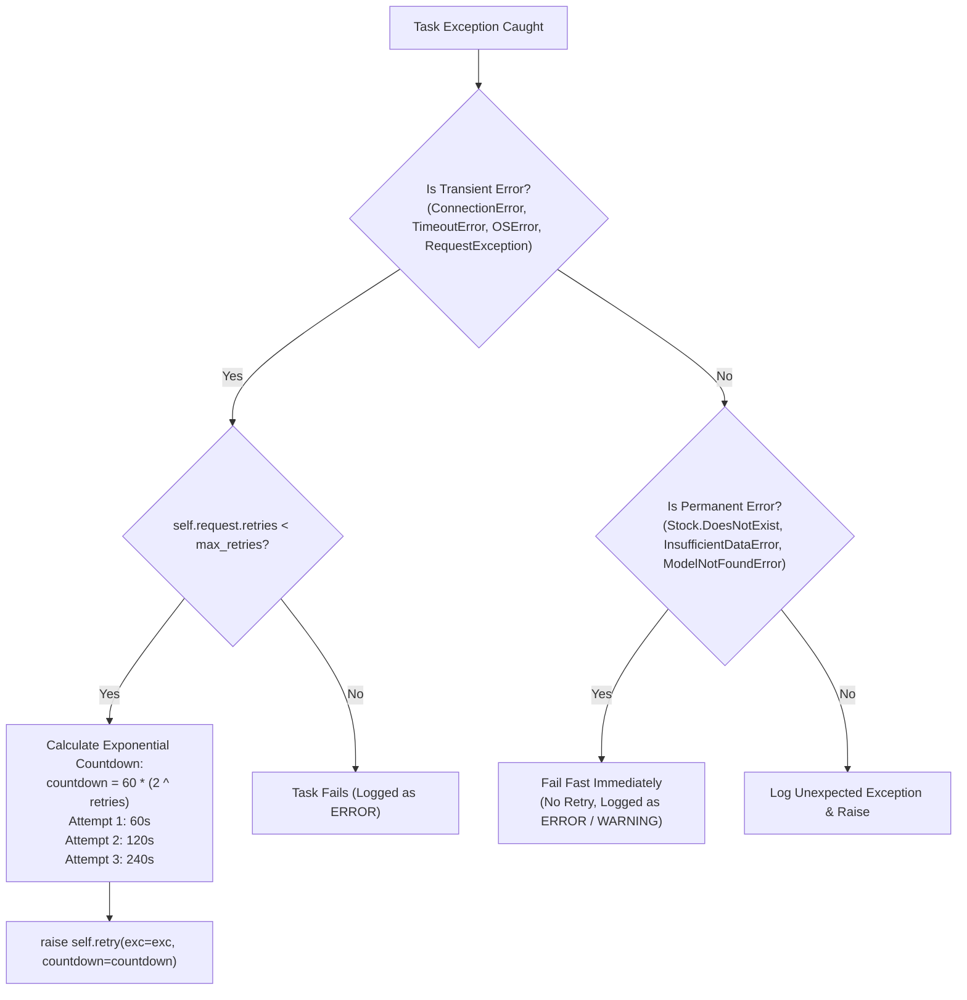

# Enterprise Stock Intelligence Platform — Celery & Redis Architecture

This document provides a technical reference for the asynchronous task execution framework, periodic scheduling, queue management, retry policies, and Redis multi-database partitioning powering the **Enterprise Stock Intelligence Platform (MarketIQ)**.

---

## 📑 Table of Contents

- [Architecture Overview](#architecture-overview)
- [Redis Dual-Database Partitioning](#redis-dual-database-partitioning)
- [Celery Configuration](#celery-configuration)
- [Periodic Scheduling (Celery Beat)](#periodic-scheduling-celery-beat)
- [Task Catalog & Implementation Details](#task-catalog--implementation-details)
  - [1. `ingest_market_data_task`](#1-ingest_market_data_task)
  - [2. `poll_market_data_task`](#2-poll_market_data_task)
  - [3. `scheduled_market_data_ingest`](#3-scheduled_market_data_ingest)
  - [4. `generate_live_prediction_task`](#4-generate_live_prediction_task)
  - [5. `resolve_pending_predictions_task`](#5-resolve_pending_predictions_task)
- [Retry Policies & Fault Classification](#retry-policies--fault-classification)
- [Operational Monitoring & Diagnostics](#operational-monitoring--diagnostics)

---

## 🏗 Architecture Overview

Market data ingestion, 12-feature technical indicator engineering, machine learning inference, and prediction outcome realization are inherently I/O-heavy operations. Offloading these workflows from the HTTP request/response cycle ensures web endpoints respond in $< 100\text{ ms}$ while Celery handles asynchronous workloads with guaranteed retry semantics.



---

## 🗄 Redis Dual-Database Partitioning

To prevent memory contention, key collision, and performance degradation between Celery background tasks and high-frequency WebSocket pub/sub messaging, Redis 7 is partitioned into two isolated logical databases:

| Database | Connection URI | Responsibility | Key Patterns |
| :--- | :--- | :--- | :--- |
| **Redis DB 0** | `redis://redis:6379/0` | **Celery Broker & Backend**: Task queues, task state tracking, result metadata | `celery-task-meta-*`, `_kombu.binding.*` |
| **Redis DB 1** | `redis://redis:6379/1` | **Django Channels Layer**: Asynchronous pub/sub channel groups for real-time WebSocket streaming | `asgi:group:market_data_*`, `asgi:group:predictions_*` |

### Django Configuration (`backend/config/settings.py`)

```python
# Celery Broker & Backend (DB 0)
CELERY_BROKER_URL = os.getenv('REDIS_URL', 'redis://localhost:6379/0')
CELERY_RESULT_BACKEND = os.getenv('REDIS_URL', 'redis://localhost:6379/0')

# Django Channels Layer (DB 1)
CHANNEL_REDIS_URL = os.getenv('CHANNEL_REDIS_URL', os.getenv('REDIS_URL', 'redis://localhost:6379/1'))
CHANNEL_LAYERS = {
    'default': {
        'BACKEND': 'channels_redis.core.RedisChannelLayer',
        'CONFIG': {
            'hosts': [CHANNEL_REDIS_URL],
        },
    },
}
```

---

## ⚙️ Celery Configuration

The Celery application is configured in `backend/config/celery.py` and initialized with strict enterprise serialization and boundary constraints:

```python
# Celery Core Settings
CELERY_ACCEPT_CONTENT = ['json']       # Only JSON accepted (prevents pickle vulnerabilities)
CELERY_TASK_SERIALIZER = 'json'       # Task arguments serialized as JSON
CELERY_RESULT_SERIALIZER = 'json'     # Task return values serialized as JSON
CELERY_TIMEZONE = 'UTC'               # All schedules synchronized to UTC
CELERY_TASK_TRACK_STARTED = True      # Track when tasks transition from PENDING to STARTED
CELERY_TASK_TIME_LIMIT = 300          # 5-minute hard execution limit per task
```

---

## ⏰ Periodic Scheduling (Celery Beat)

The Celery Beat daemon (`stock_celery_beat`) evaluates periodic schedules defined in `settings.py`:

```python
CELERY_BEAT_SCHEDULE = {
    'poll-market-data-regularly': {
        'task': 'market_data.tasks.scheduled_market_data_ingest',
        'schedule': float(MARKET_DATA_INGEST_INTERVAL_SECONDS), # Default: 300.0s (5 minutes)
    },
    'resolve-pending-predictions-regularly': {
        'task': 'predictions.tasks.resolve_pending_predictions_task',
        'schedule': 300.0, # Every 5 minutes
    },
}
```

### Schedule Execution Details

1. **`poll-market-data-regularly` (300s)**:
   - Evaluates `MARKET_DATA_SYMBOLS` (`TCS.NS`, `RELIANCE.NS`, `INFY.NS`, `HDFCBANK.NS`).
   - Dispatches parallel `poll_market_data_task` jobs to the worker pool.
   - Each poll task retrieves the latest candle, persists it to `market_prices`, and triggers `generate_live_prediction_task`.
2. **`resolve-pending-predictions-regularly` (300s)**:
   - Queries `predictions` for all records with `outcome = 'PENDING'`.
   - Compares the prediction's market data timestamp with subsequent closing bars.
   - Computes realized return and updates outcome to `CORRECT` or `INCORRECT`.

---

## 📋 Task Catalog & Implementation Details

### 1. `ingest_market_data_task`

- **Module**: `market_data.tasks`
- **Trigger**: Manual API request (`POST /api/market-data/ingest/`) or bulk CLI command (`python manage.py ingest_market_data`).
- **Function Signature**:
  ```python
  @shared_task(bind=True, max_retries=3, default_retry_delay=60, name="market_data.tasks.ingest_market_data_task")
  def ingest_market_data_task(self, symbol: str, period: str = "1y", interval: str = "1d") -> Dict[str, Any]
  ```
- **Execution Flow**:
  1. Validates that `symbol` exists in `stocks` table.
  2. Invokes `MarketDataService.fetch_historical_data(symbol, period, interval)`.
  3. Uses `MarketPrice.objects.update_or_create(...)` with composite key `(stock, timestamp, timeframe, source)` for idempotency.
  4. Returns `{ "symbol": symbol, "records_created": N, "records_updated": M }`.

---

### 2. `poll_market_data_task`

- **Module**: `market_data.tasks`
- **Trigger**: Dispatched by `scheduled_market_data_ingest` or manual trigger (`POST /api/market-data/poll/`).
- **Function Signature**:
  ```python
  @shared_task(bind=True, max_retries=3, default_retry_delay=60, name="market_data.tasks.poll_market_data_task")
  def poll_market_data_task(self, symbol: str, interval: str = "1d") -> Dict[str, Any]
  ```
- **Execution Flow**:
  1. Invokes `MarketDataService.run_ingestion_cycle(symbol, interval)`.
  2. Fetches latest bar from external source (`yfinance`).
  3. Upserts candle into `market_prices`.
  4. Dispatches `generate_live_prediction_task.delay(symbol=symbol)` to produce immediate inference on the fresh bar.

---

### 3. `scheduled_market_data_ingest`

- **Module**: `market_data.tasks`
- **Trigger**: Celery Beat timer (every 300 seconds).
- **Function Signature**:
  ```python
  @shared_task(name="market_data.tasks.scheduled_market_data_ingest")
  def scheduled_market_data_ingest() -> Dict[str, Any]
  ```
- **Execution Flow**:
  1. Reads `settings.MARKET_DATA_SYMBOLS`.
  2. Iterates over universe and enqueues individual `poll_market_data_task.delay(symbol=symbol)`.
  3. Returns dispatch summary with task IDs.

---

### 4. `generate_live_prediction_task`

- **Module**: `predictions.tasks`
- **Trigger**: Chained after successful price ingestion or manual API request (`POST /api/predictions/generate/`).
- **Function Signature**:
  ```python
  @shared_task(bind=True, max_retries=3, default_retry_delay=60, name="predictions.tasks.generate_live_prediction_task")
  def generate_live_prediction_task(self, symbol: str, model_type: str = "xgboost_classifier", version: str = "v1", price_data: Optional[Dict] = None) -> Optional[Dict]
  ```
- **Execution Flow**:
  1. Loads production model artifact (`xgboost_classifier_<SYMBOL>_v1.joblib`) from disk or memory cache.
  2. Queries recent historical bars to compute the 12 technical indicator features.
  3. Executes model inference (`predict` and `predict_proba`).
  4. Persists record to `predictions` table with `outcome='PENDING'`.
  5. Broadcasts event payload to Django Channels WebSocket group `predictions_<symbol>`.

---

### 5. `resolve_pending_predictions_task`

- **Module**: `predictions.tasks`
- **Trigger**: Celery Beat timer (every 300 seconds).
- **Function Signature**:
  ```python
  @shared_task(bind=True, max_retries=2, default_retry_delay=30, name="predictions.tasks.resolve_pending_predictions_task")
  def resolve_pending_predictions_task(self, symbol: Optional[str] = None) -> Dict[str, Any]
  ```
- **Execution Flow**:
  1. Calls `PredictionResolutionService.resolve_pending_predictions(symbol)`.
  2. Identifies pending predictions where the subsequent market bar has closed.
  3. Calculates realized return:
     $$\text{actual\_return} = \frac{P_{t+1} - P_t}{P_t}$$
  4. Evaluates outcome:
     $$\text{outcome} = \begin{cases} \text{CORRECT} & \text{if } (\text{actual\_return} \ge 0 \land \text{prediction} = \text{'UP'}) \lor (\text{actual\_return} < 0 \land \text{prediction} = \text{'DOWN'}) \\ \text{INCORRECT} & \text{otherwise} \end{cases}$$
  5. Saves `actual_direction`, `actual_return`, `outcome`, and `resolved_at`.

---

## 🛡 Retry Policies & Fault Classification

Tasks implement **bounded exponential backoff** to handle transient network outages while failing fast on deterministic schema or logic errors:



---

## 🔍 Operational Monitoring & Diagnostics

### Inspecting Celery Workers via Docker

```bash
# Check worker status and active pool threads
docker compose exec celery_worker celery -A config status

# Inspect currently executing tasks
docker compose exec celery_worker celery -A config inspect active

# Inspect scheduled tasks (in worker buffer)
docker compose exec celery_worker celery -A config inspect scheduled

# Inspect registered tasks known to worker
docker compose exec celery_worker celery -A config inspect registered
```

### Inspecting Redis Queues

```bash
# Connect to Redis CLI inside container
docker compose exec redis redis-cli

# Check queue length for default Celery queue (DB 0)
SELECT 0
LLEN celery

# View active keys in DB 0
KEYS celery*

# Check WebSocket pub/sub connection stats (DB 1)
SELECT 1
INFO pubsub
```

