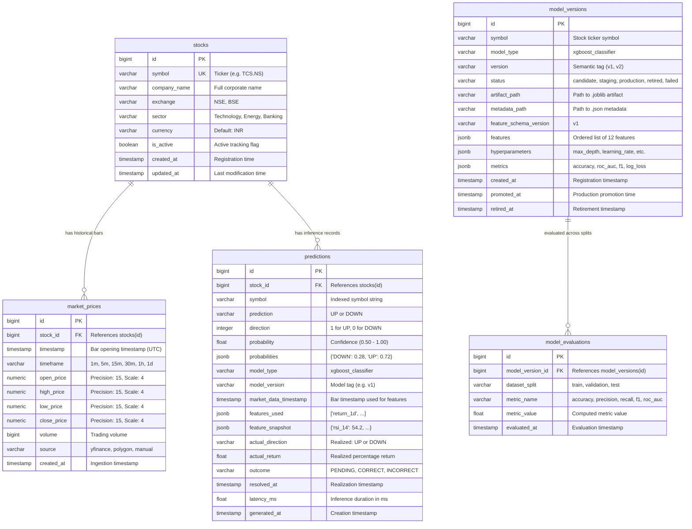

# Enterprise Stock Intelligence Platform — Database Architecture & Schema Specification

This document provides a comprehensive reference for the PostgreSQL 16 relational database architecture, entity relationships, physical schema definitions, composite indexes, integrity constraints, and query optimization patterns powering the **Enterprise Stock Intelligence Platform (MarketIQ)**.

---

## 📑 Table of Contents

- [Database Architecture Overview](#database-architecture-overview)
- [Entity-Relationship Diagram (ERD)](#entity-relationship-diagram-erd)
- [Table Specifications](#table-specifications)
  - [1. `stocks` — Security Universe Registry](#1-stocks--security-universe-registry)
  - [2. `market_prices` — OHLCV Historical & Intraday Bars](#2-market_prices--ohlcv-historical--intraday-bars)
  - [3. `predictions` — Directional Inference Records & Outcomes](#3-predictions--directional-inference-records--outcomes)
  - [4. `model_versions` — Machine Learning Model Registry](#4-model_versions--machine-learning-model-registry)
  - [5. `model_evaluations` — Split-Level Performance Metrics](#5-model_evaluations--split-level-performance-metrics)
- [Indexes & Query Optimization](#indexes--query-optimization)
- [Idempotency & Data Integrity Constraints](#idempotency--data-integrity-constraints)
- [Django Migrations History](#django-migrations-history)
- [Database Administration & Maintenance](#database-administration--maintenance)

---

## 🏛 Database Architecture Overview

The platform uses **PostgreSQL 16** as its primary system of record. It is configured for financial time-series persistence, high-concurrency read queries, and asynchronous batch insertions from Celery ingestion workers.

| Parameter | Specification | Purpose / Rationale |
| :--- | :--- | :--- |
| **Engine** | PostgreSQL 16.4 | ACID compliance, JSONB support, robust indexing |
| **Container Service** | `stock_postgres` | Isolated Docker network (`stock_network`) |
| **Internal Port** | `5432` | Standard PostgreSQL port |
| **Default Database** | `stock_prediction_db` | Application database |
| **Character Set / Collation**| `UTF8` / `en_US.utf8` | Universal string encoding |
| **Timezone** | `UTC` | All timestamps stored in UTC (`USE_TZ = True`) |
| **Primary Connection Pooling**| Django persistent connections (`CONN_MAX_AGE = 60`) | Low-overhead connection reuse |

---

## 📊 Entity-Relationship Diagram (ERD)



---

## 📋 Table Specifications

### 1. `stocks` — Security Universe Registry

Stores all tracked assets. Acts as the root parent entity for market prices and predictions.

| Column | Data Type | Nullable | Default | Description |
| :--- | :--- | :--- | :--- | :--- |
| `id` | `BIGSERIAL` | NO | Auto | Primary key |
| `symbol` | `VARCHAR(20)` | NO | — | Unique ticker symbol (e.g. `TCS.NS`, `RELIANCE.NS`) |
| `company_name` | `VARCHAR(150)` | NO | — | Full legal company name |
| `exchange` | `VARCHAR(20)` | NO | — | Exchange code (`NSE`, `BSE`, `NASDAQ`) |
| `sector` | `VARCHAR(100)` | YES | `''` | Economic sector (`Technology`, `Energy`, `Banking`) |
| `currency` | `VARCHAR(10)` | NO | `'INR'` | Trading currency code |
| `is_active` | `BOOLEAN` | NO | `TRUE` | Whether active polling/predictions are enabled |
| `created_at` | `TIMESTAMPTZ` | NO | `NOW()` | Registration timestamp |
| `updated_at` | `TIMESTAMPTZ` | NO | `NOW()` | Last update timestamp |

**Indexes & Constraints:**
- **Primary Key**: `PRIMARY KEY (id)`
- **Unique**: `UNIQUE (symbol)`
- **Indexes**:
  - `CREATE INDEX stocks_symbol_idx ON stocks (symbol);`
  - `CREATE INDEX stocks_exchange_idx ON stocks (exchange);`
  - `CREATE INDEX stocks_sector_idx ON stocks (sector);`

---

### 2. `market_prices` — OHLCV Historical & Intraday Bars

Stores normalized OHLCV candlestick price bars. Every bar represents a discrete timeframe (e.g. daily `1d`, 5-minute `5m`).

| Column | Data Type | Nullable | Default | Description |
| :--- | :--- | :--- | :--- | :--- |
| `id` | `BIGSERIAL` | NO | Auto | Primary key |
| `stock_id` | `BIGINT` | NO | — | Foreign key referencing `stocks(id)` with `ON DELETE CASCADE` |
| `timestamp` | `TIMESTAMPTZ` | NO | — | Candle opening timestamp in UTC |
| `timeframe` | `VARCHAR(10)` | NO | `'1d'` | Granularity: `1m`, `5m`, `15m`, `30m`, `1h`, `1d` |
| `open_price` | `NUMERIC(15, 4)` | NO | — | Opening price for the period |
| `high_price` | `NUMERIC(15, 4)` | NO | — | Highest traded price during the period |
| `low_price` | `NUMERIC(15, 4)` | NO | — | Lowest traded price during the period |
| `close_price` | `NUMERIC(15, 4)` | NO | — | Closing traded price during the period |
| `volume` | `BIGINT` | NO | `0` | Cumulative shares traded in the candle |
| `source` | `VARCHAR(50)` | NO | `'unknown'` | Data provider (e.g. `yfinance`, `polygon`) |
| `created_at` | `TIMESTAMPTZ` | NO | `NOW()` | Ingestion timestamp |

**Constraints & Composite Uniqueness:**
```sql
CONSTRAINT unique_market_price UNIQUE (stock_id, timestamp, timeframe, source);
```
> [!IMPORTANT]
> The composite unique constraint prevents duplicate candle ingestion even when concurrent or overlapping Celery tasks fetch overlapping date ranges. Ingestion utilizes Django's `update_or_create()` matching this tuple.

**Performance Indexes:**
```sql
CREATE INDEX market_prices_stock_id_timestamp_idx ON market_prices (stock_id, timestamp);
CREATE INDEX market_prices_timestamp_idx ON market_prices (timestamp);
CREATE INDEX market_prices_stock_tf_ts_idx ON market_prices (stock_id, timeframe, timestamp);
```

---

### 3. `predictions` — Directional Inference Records & Outcomes

Stores every inference output produced by `PredictionService`. Tracks model confidence, features evaluated, inference latency, and actual realized outcomes when the next market candle closes.

| Column | Data Type | Nullable | Default | Description |
| :--- | :--- | :--- | :--- | :--- |
| `id` | `BIGSERIAL` | NO | Auto | Primary key |
| `stock_id` | `BIGINT` | NO | — | Foreign key referencing `stocks(id)` with `ON DELETE CASCADE` |
| `symbol` | `VARCHAR(20)` | NO | — | Indexed symbol string for fast search without joins |
| `prediction` | `VARCHAR(10)` | NO | — | Predicted label: `'UP'` or `'DOWN'` |
| `direction` | `INTEGER` | NO | — | Binary representation: `1` for UP, `0` for DOWN |
| `probability` | `DOUBLE PRECISION`| NO | — | Confidence score of the predicted class ($0.50 \le p \le 1.00$) |
| `probabilities` | `JSONB` | NO | `'{}'` | Full probability distribution: `{"DOWN": 0.28, "UP": 0.72}` |
| `model_type` | `VARCHAR(50)` | NO | `'xgboost_classifier'` | ML algorithm name |
| `model_version` | `VARCHAR(20)` | NO | `'v1'` | Deployed model version tag |
| `market_data_timestamp` | `TIMESTAMPTZ` | YES | `NULL` | Timestamp of the price bar that formed feature inputs |
| `features_used` | `JSONB` | NO | `'[]'` | List of 12 feature names evaluated |
| `feature_snapshot` | `JSONB` | YES | `'{}'` | Key-value dictionary of the exact 12 feature values |
| `actual_direction` | `VARCHAR(10)` | YES | `NULL` | Realized market direction after next bar: `'UP'` or `'DOWN'` |
| `actual_return` | `DOUBLE PRECISION`| YES | `NULL` | Realized next-day percentage return: $\frac{P_{t+1} - P_t}{P_t}$ |
| `outcome` | `VARCHAR(20)` | NO | `'PENDING'` | Lifecycle state: `'PENDING'`, `'CORRECT'`, `'INCORRECT'` |
| `resolved_at` | `TIMESTAMPTZ` | YES | `NULL` | Timestamp when actual return was realized and resolved |
| `latency_ms` | `DOUBLE PRECISION`| YES | `NULL` | Inference pipeline execution time in milliseconds |
| `generated_at` | `TIMESTAMPTZ` | NO | `NOW()` | Inference generation timestamp |

**Constraints & Composite Uniqueness:**
```sql
CONSTRAINT unique_prediction_per_market_timestamp UNIQUE (stock_id, market_data_timestamp, model_version);
```
> [!NOTE]
> This constraint ensures idempotency: if the system requests a prediction for the same stock, market bar, and model version, it updates the existing record rather than polluting historical tables.

**Performance Indexes:**
```sql
CREATE INDEX predictions_stock_gen_at_idx ON predictions (stock_id, generated_at DESC);
CREATE INDEX predictions_symbol_gen_at_idx ON predictions (symbol, generated_at DESC);
CREATE INDEX predictions_market_data_ts_idx ON predictions (market_data_timestamp);
CREATE INDEX predictions_symbol_outcome_idx ON predictions (symbol, outcome);
CREATE INDEX predictions_version_outcome_idx ON predictions (model_version, outcome);
```

---

### 4. `model_versions` — Machine Learning Model Registry

Maintains model metadata, training configuration, file paths to serialized `.joblib` weights, and production lifecycle status.

| Column | Data Type | Nullable | Default | Description |
| :--- | :--- | :--- | :--- | :--- |
| `id` | `BIGSERIAL` | NO | Auto | Primary key |
| `symbol` | `VARCHAR(20)` | NO | — | Target stock symbol (e.g. `TCS.NS`) |
| `model_type` | `VARCHAR(50)` | NO | `'xgboost_classifier'` | Algorithm architecture identifier |
| `version` | `VARCHAR(20)` | NO | — | Version tag (`v1`, `v2`, etc.) |
| `status` | `VARCHAR(20)` | NO | `'candidate'` | Lifecycle: `candidate`, `staging`, `production`, `retired`, `failed` |
| `artifact_path` | `VARCHAR(255)` | NO | — | Relative or absolute path to `.joblib` model binary |
| `metadata_path` | `VARCHAR(255)` | NO | — | Path to `.json` metadata file containing hyperparameters & metrics |
| `feature_schema_version` | `VARCHAR(20)` | NO | `'v1'` | Feature schema contract version |
| `features` | `JSONB` | NO | `'[]'` | Array of 12 feature names expected by the model |
| `hyperparameters` | `JSONB` | NO | `'{}'` | XGBoost training params (`n_estimators`, `max_depth`, `learning_rate`) |
| `metrics` | `JSONB` | NO | `'{}'` | Evaluation metrics dictionary (`accuracy`, `f1`, `roc_auc`, `log_loss`) |
| `created_at` | `TIMESTAMPTZ` | NO | `NOW()` | Registration timestamp |
| `promoted_at` | `TIMESTAMPTZ` | YES | `NULL` | Production promotion timestamp |
| `retired_at` | `TIMESTAMPTZ` | YES | `NULL` | Retirement timestamp |

**Constraints & Composite Uniqueness:**
```sql
CONSTRAINT unique_model_version_per_symbol_and_type UNIQUE (symbol, model_type, version);
```

**Performance Indexes:**
```sql
CREATE INDEX model_versions_sym_type_status_idx ON model_versions (symbol, model_type, status);
CREATE INDEX model_versions_sym_status_idx ON model_versions (symbol, status);
```

---

### 5. `model_evaluations` — Split-Level Performance Metrics

Provides granular metric tracking for model versions across dataset splits (`train`, `validation`, `test`).

| Column | Data Type | Nullable | Default | Description |
| :--- | :--- | :--- | :--- | :--- |
| `id` | `BIGSERIAL` | NO | Auto | Primary key |
| `model_version_id` | `BIGINT` | NO | — | Foreign key referencing `model_versions(id)` with `ON DELETE CASCADE` |
| `dataset_split` | `VARCHAR(20)` | NO | — | Dataset split: `train`, `validation`, `test` |
| `metric_name` | `VARCHAR(50)` | NO | — | Metric identifier: `accuracy`, `precision`, `recall`, `f1`, `roc_auc`, `log_loss` |
| `metric_value` | `DOUBLE PRECISION`| NO | — | Calculated metric float value |
| `evaluated_at` | `TIMESTAMPTZ` | NO | `NOW()` | Computation timestamp |

**Performance Indexes:**
```sql
CREATE INDEX model_evals_ver_split_metric_idx ON model_evaluations (model_version_id, dataset_split, metric_name);
```

---

## ⚡ Indexes & Query Optimization

The database schema is tuned specifically for real-time analytics, high-frequency dashboard queries, and time-series aggregations:

1. **Covering Queries for Recent Predictions**:
   - `predictions (symbol, generated_at DESC)` allows fetching the latest prediction for a ticker in $< 1\text{ ms}$ without scanning older records.
2. **Fast Resolution of Pending Inferences**:
   - `predictions (symbol, outcome)` allows Celery's `resolve_pending_predictions_task` to instantly filter `outcome='PENDING'` records without table scans.
3. **Time-Series Slicing for Interactive Charts**:
   - `market_prices (stock_id, timeframe, timestamp)` enables efficient range queries for timeframe filters (`1D`, `5D`, `1M`, `3M`, `6M`, `1Y`) in the Stock Analysis module.
4. **Model Registry Promotion Lookups**:
   - `model_versions (symbol, model_type, status)` allows `PredictionService` to load the active `status='production'` model version in $O(1)$ index time.

---

## 🔒 Idempotency & Data Integrity Constraints

| Table | Constraint Name | Fields | Business Purpose |
| :--- | :--- | :--- | :--- |
| `stocks` | `stocks_symbol_key` | `symbol` | Guarantees uniqueness of ticker symbols. |
| `market_prices` | `unique_market_price` | `stock, timestamp, timeframe, source` | Prevents duplicate OHLCV bars across repeated ingestion cycles. |
| `predictions` | `unique_prediction_per_market_timestamp` | `stock, market_data_timestamp, model_version` | Prevents duplicate predictions for identical market data bars and model versions. |
| `model_versions`| `unique_model_version_per_symbol_and_type` | `symbol, model_type, version` | Ensures deterministic version tagging per model type and ticker. |

---

## 📜 Django Migrations History

All database schemas are managed through Django's migration engine:

```bash
# Verify migration status across apps
docker compose exec backend python manage.py showmigrations
```

| App | Migration File | Description |
| :--- | :--- | :--- |
| `stocks` | `0001_initial.py` | Creates `stocks` table with indexes on `symbol`, `exchange`, and `sector`. |
| `market_data` | `0001_initial.py` | Creates `market_prices` table with composite unique constraint and indexes. |
| `predictions` | `0001_initial.py` | Creates `predictions` table with fields for direction, probability, and outcome. |
| `predictions` | `0002_modelversion_modelevaluation...` | Creates `model_versions` and `model_evaluations` tables for ML model registry. |
| `predictions` | `0003_add_unique_constraint.py` | Adds `unique_prediction_per_market_timestamp` composite unique constraint. |

---

## 🛠 Database Administration & Maintenance

### Direct Access via Docker

```bash
# Connect to PostgreSQL shell inside container
docker compose exec postgres psql -U postgres -d stock_prediction_db

# Check table row counts
SELECT 'stocks' AS table_name, COUNT(*) FROM stocks
UNION ALL
SELECT 'market_prices', COUNT(*) FROM market_prices
UNION ALL
SELECT 'predictions', COUNT(*) FROM predictions
UNION ALL
SELECT 'model_versions', COUNT(*) FROM model_versions
UNION ALL
SELECT 'model_evaluations', COUNT(*) FROM model_evaluations;
```

### Automated Backup & Restore

```bash
# Create compressed SQL dump
docker compose exec -T postgres pg_dump -U postgres stock_prediction_db | gzip > backup_$(date +%Y%m%d_%H%M%S).sql.gz

# Restore database from compressed dump
gunzip -c backup_20260922_000000.sql.gz | docker compose exec -T postgres psql -U postgres -d stock_prediction_db
```

### Query Plan Analysis & Vacuuming

```sql
-- Analyze query execution plan for recent predictions
EXPLAIN ANALYZE
SELECT * FROM predictions 
WHERE symbol = 'TCS.NS' 
ORDER BY generated_at DESC 
LIMIT 10;

-- Maintenance vacuum and statistics update
VACUUM ANALYZE market_prices;
VACUUM ANALYZE predictions;
```

