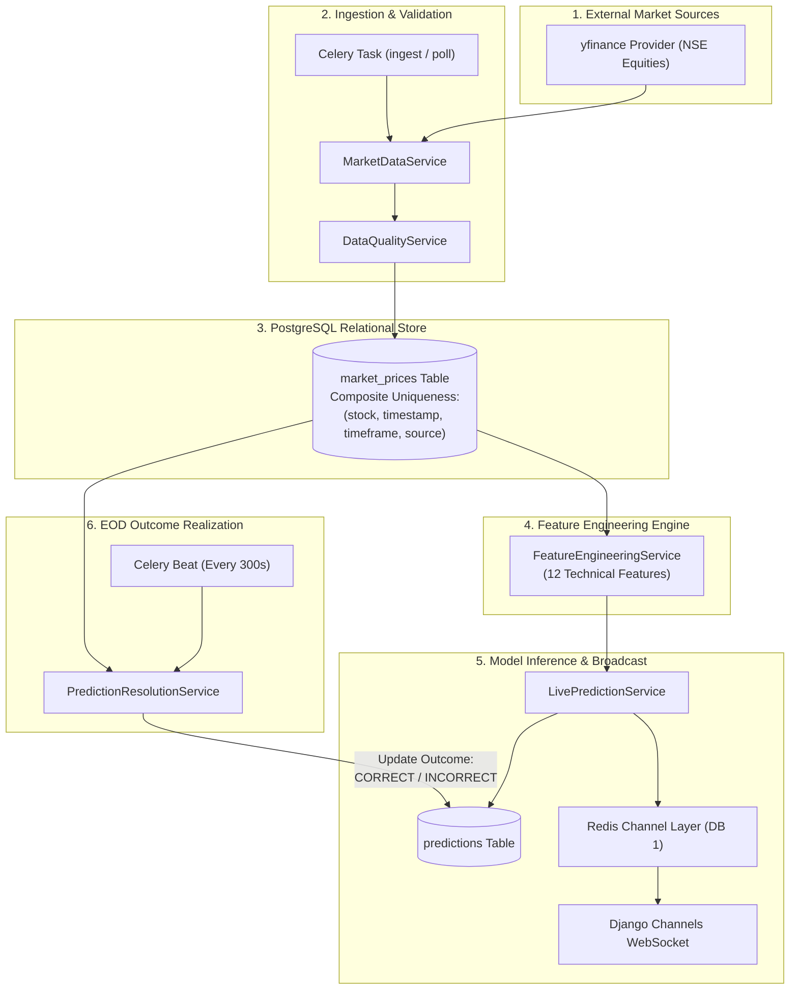

# Data Pipeline & Ingestion Architecture

This document details the complete end-to-end data lifecycle in **MarketIQ**, from external market data ingestion and time-series persistence to technical feature engineering, real-time WebSocket distribution, and prediction outcome realization.

---

## 📑 Table of Contents

- [Data Pipeline Overview](#data-pipeline-overview)
- [1. Market Data Ingestion Tier](#1-market-data-ingestion-tier)
- [2. Time-Series Persistence & Hygiene](#2-time-series-persistence--hygiene)
- [3. Technical Feature Engineering Pipeline](#3-technical-feature-engineering-pipeline)
- [4. Real-Time Streaming & WebSocket Distribution](#4-real-time-streaming--websocket-distribution)
- [5. Prediction Outcome Realization Pipeline](#5-prediction-outcome-realization-pipeline)
- [6. Data Hygiene & Validation Matrix](#6-data-hygiene--validation-matrix)

---

## 🌊 Data Pipeline Overview



---

## 1. Market Data Ingestion Tier

### 1.1 Ingestion Triggers
Market data ingestion is initiated via three separate mechanisms:
1. **Periodic Celery Beat**: Executes `market_data.tasks.scheduled_market_data_ingest` every 300 seconds during active market regimes across all 14 configured equities (`MARKET_DATA_SYMBOLS`).
2. **On-Demand User Selection**: Triggered whenever an analyst selects a new stock symbol in the UI via `GET /api/predictions/<symbol>/` or `GET /api/market-data/<symbol>/history/`.
3. **CLI Management Commands**:
   - Register universe: `python manage.py register_universe` (registers all 14 NSE equities).
   - Ingest data: `python manage.py ingest_market_data --symbol TCS.NS --period 1y` (or any of the 14 symbols).

### 1.2 Supported Stock Universe
The platform tracks 14 liquid NSE equities across 7 sectors:
`TCS.NS`, `INFY.NS`, `RELIANCE.NS`, `HDFCBANK.NS`, `ICICIBANK.NS`, `SBIN.NS`, `LT.NS`, `ITC.NS`, `BHARTIARTL.NS`, `AXISBANK.NS`, `KOTAKBANK.NS`, `HINDUNILVR.NS`, `MARUTI.NS`, `SUNPHARMA.NS`.

### 1.3 Ingestion Implementation
Handled by `market_data.services.market_data_service.MarketDataService`:
- Normalizes ticker symbols (e.g., ensuring `.NS` suffix for National Stock Exchange of India).
- Queries `yfinance.Ticker(symbol).history(period=period, interval=interval)`.
- Validates data integrity (verifies non-empty dataframe, required OHLCV columns).
- Converts timestamps to UTC-aware datetime objects in Asia/Kolkata timezone context.

---

## 2. Time-Series Persistence & Hygiene

### 2.1 Database Schema: `market_prices` Table
Every ingested price observation is persisted to the `market_prices` table in PostgreSQL:

| Column | Type | Constraints / Modifiers | Description |
|---|---|---|---|
| `id` | `BIGSERIAL` | Primary Key | Unique row identifier |
| `stock_id` | `BIGINT` | Foreign Key (`stocks.id`) | Reference to registered stock |
| `timestamp` | `TIMESTAMP WITH TIME ZONE` | Indexed, Not Null | Bar closing timestamp |
| `timeframe` | `VARCHAR(10)` | Default `'1d'` | Aggregation interval |
| `open_price` | `NUMERIC(15, 4)` | Not Null | Opening price in ₹ |
| `high_price` | `NUMERIC(15, 4)` | Not Null | Session high in ₹ |
| `low_price` | `NUMERIC(15, 4)` | Not Null | Session low in ₹ |
| `close_price` | `NUMERIC(15, 4)` | Not Null | Closing price in ₹ |
| `volume` | `BIGINT` | Default `0`, Not Null | Total traded shares |
| `source` | `VARCHAR(50)` | Default `'yfinance'` | Data source identifier |
| `created_at` | `TIMESTAMP WITH TIME ZONE` | Auto now add | Record creation timestamp |

### 2.2 Idempotency & Conflict Resolution
To prevent duplicate records from overlapping polling intervals, the table enforces:
```sql
CONSTRAINT unique_market_price UNIQUE (stock_id, timestamp, timeframe, source);
```
Persistence utilizes Django's `bulk_create` with conflict handling:
```python
MarketPrice.objects.bulk_create(
    records_to_insert,
    update_conflicts=True,
    unique_fields=["stock", "timestamp", "timeframe", "source"],
    update_fields=["open_price", "high_price", "low_price", "close_price", "volume"],
)
```

---

## 3. Technical Feature Engineering Pipeline

### 3.1 The 12 Production Features
The feature engineering engine (`market_data.services.feature_engineering.FeatureEngineeringService`) computes 12 mathematical indicators on historical daily price series:

| Feature Name | Category | Minimum Warmup | Mathematical Formulation |
|---|---|---|---|
| **`return_1d`** | Returns | 2 bars | $\frac{C_t - C_{t-1}}{C_{t-1}}$ |
| **`return_5d`** | Returns | 6 bars | $\frac{C_t - C_{t-5}}{C_{t-5}}$ |
| **`sma_10`** | Trend | 10 bars | $\frac{1}{10} \sum_{i=0}^{9} C_{t-i}$ |
| **`sma_20`** | Trend | 20 bars | $\frac{1}{20} \sum_{i=0}^{19} C_{t-i}$ |
| **`sma_50`** | Trend | 50 bars | $\frac{1}{50} \sum_{i=0}^{49} C_{t-i}$ |
| **`ema_12`** | Trend | 12 bars | $\alpha \cdot C_t + (1 - \alpha) \cdot EMA_{t-1}, \quad \alpha = \frac{2}{13}$ |
| **`ema_26`** | Trend | 26 bars | $\alpha \cdot C_t + (1 - \alpha) \cdot EMA_{t-1}, \quad \alpha = \frac{2}{27}$ |
| **`macd`** | Momentum | 26 bars | $EMA_{12}(C_t) - EMA_{26}(C_t)$ |
| **`macd_signal`**| Momentum | 35 bars | $EMA_9(MACD_t)$ |
| **`rsi_14`** | Momentum | 15 bars | $100 - \left( \frac{100}{1 + RS} \right), \quad RS = \frac{\text{Avg Gain}_{14}}{\text{Avg Loss}_{14}}$ |
| **`volatility_20`**| Volatility | 20 bars | $\sqrt{252} \cdot \sigma_{20}(\text{return\_1d})$ |
| **`volume_change`**| Volume | 2 bars | $\frac{V_t - V_{t-1}}{V_{t-1}}$ |

### 3.2 Lookahead Bias Elimination
All features for prediction at session $t$ are derived **strictly from bars $i \le t$**. No future pricing or volume information is ever accessed during feature transformation.

---

## 4. Real-Time Streaming & WebSocket Distribution

1. When a new market observation arrives via Celery polling, `market_data.services.realtime_service.RealtimeService` evaluates the quote.
2. It publishes a `market_update` event to the Redis Channel Layer group `market_<symbol>`:
   ```python
   async_to_sync(channel_layer.group_send)(
       f"market_{symbol}",
       {
           "type": "market_update",
           "data": {
               "symbol": symbol,
               "timestamp": str(latest_price.timestamp),
               "price": float(latest_price.close_price),
               "volume": int(latest_price.volume),
           }
       }
   )
   ```
3. Connected frontend clients on `ws://localhost:8080/ws/market/<symbol>/` receive the message instantly via Daphne's `MarketConsumer` without polling.

---

## 5. Prediction Outcome Realization Pipeline

### 5.1 The Realization Lifecycle
1. When an inference is made at session $t$, the predicted direction is recorded in `predictions` with status `outcome = "PENDING"`.
2. The model targets the direction of session $t+1$:
   $$\text{Actual Direction} = \begin{cases} \text{UP} & \text{if } C_{t+1} > C_t \\ \text{DOWN} & \text{if } C_{t+1} \le C_t \end{cases}$$
3. Every 300 seconds, Celery Beat runs `resolve_pending_predictions_task`.
4. `predictions.services.prediction_resolution_service.PredictionResolutionService`:
   - Finds all `Prediction` records where `outcome = "PENDING"`.
   - Checks if a subsequent market price bar exists with `timestamp > market_data_timestamp`.
   - If found, calculates `actual_return` and determines `actual_direction`.
   - Updates `outcome` to `CORRECT` if predicted direction matched actual direction; otherwise updates to `INCORRECT`.
   - Records `resolved_at = timezone.now()`.

---

## 6. Data Hygiene & Validation Matrix

The platform executes automated validation checks on every dataset:

| Validation Rule | Audit Implementation | Pass Criteria |
|---|---|---|
| **Price Continuity** | Verify that consecutive bars have strictly non-null closing prices | Zero missing values |
| **Volume Non-Negative** | Evaluates whether trading volume records are present and non-negative | All volume records $\ge 0$ |
| **Indicator Validity** | Evaluates RSI oscillator boundaries and MACD convergence | $RSI \in [0, 100]$ |
| **Timestamp Monotonicity**| Verifies timestamps are strictly monotonically increasing | Zero duplicate collisions |
| **Outlier Bounds** | Checks for single-day price spikes exceeding $\pm 50\%$ | Zero anomalies |

