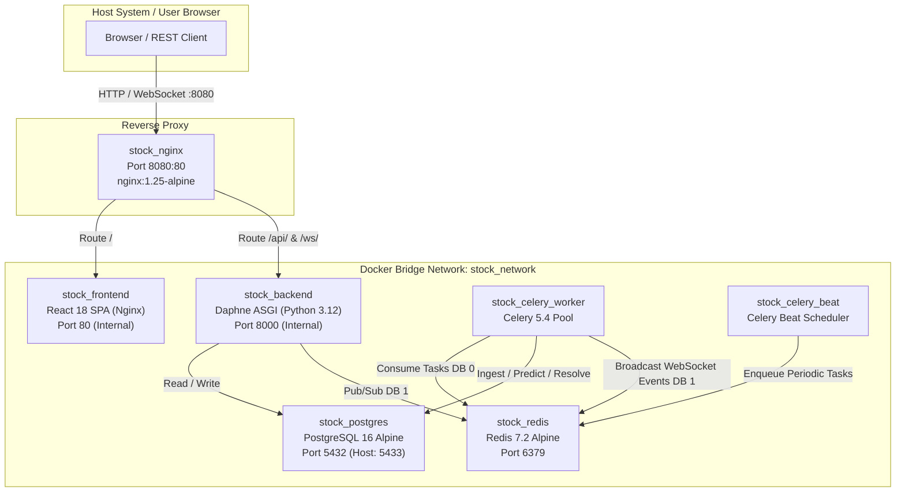
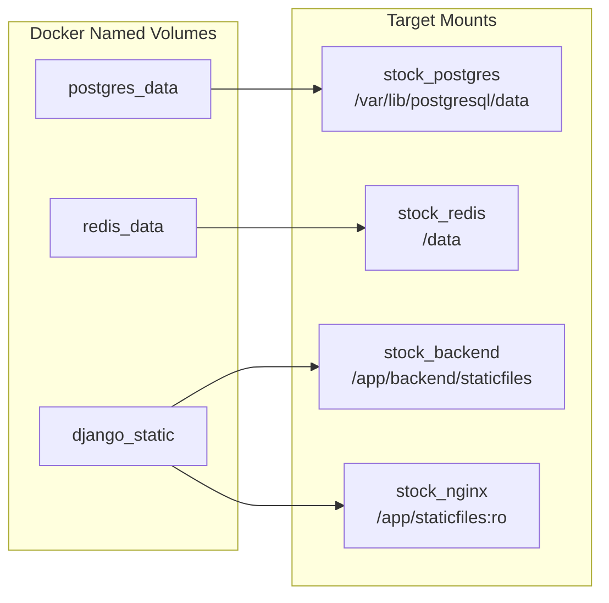
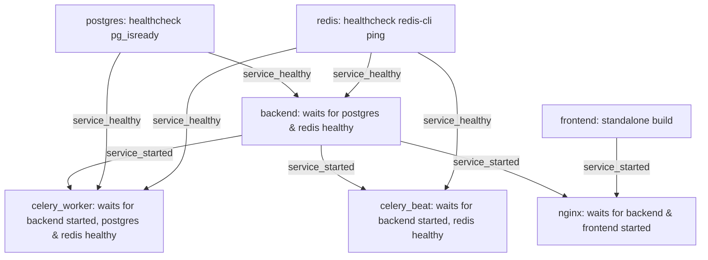

# Enterprise Stock Intelligence Platform — Docker Deployment & Orchestration Guide

This document provides a complete operations and deployment reference for orchestrating the 7 containerized services of the **Enterprise Stock Intelligence Platform (MarketIQ)** using Docker Compose.

---

## 📑 Table of Contents

- [System Topology & Container Matrix](#system-topology--container-matrix)
- [Service Catalog & Deep Dive](#service-catalog--deep-dive)
  - [1. `postgres` (Relational Database)](#1-postgres-relational-database)
  - [2. `redis` (Broker & Channel Layer)](#2-redis-broker--channel-layer)
  - [3. `backend` (Django Daphne ASGI Server)](#3-backend-django-daphne-asgi-server)
  - [4. `celery_worker` (Asynchronous Task Worker)](#4-celery_worker-asynchronous-task-worker)
  - [5. `celery_beat` (Periodic Cron Scheduler)](#5-celery_beat-periodic-cron-scheduler)
  - [6. `frontend` (React 18 SPA Runner)](#6-frontend-react-18-spa-runner)
  - [7. `nginx` (Edge Reverse Proxy & Gateway)](#7-nginx-edge-reverse-proxy--gateway)
- [Networking & Volumes](#networking--volumes)
- [Environment Configuration Matrix](#environment-configuration-matrix)
- [Health Checks & Dependency Graph](#health-checks--dependency-graph)
- [Step-by-Step Deployment Walkthrough](#step-by-step-deployment-walkthrough)
- [Operational Commands & Diagnostics](#operational-commands--diagnostics)

---

## 🌐 System Topology & Container Matrix

The platform is fully containerized across 7 dedicated services connected via a private Docker bridge network (`stock_network`). Only Nginx (`8080`), Redis (`6379`), and PostgreSQL (`5433`) expose ports to the host system.



### Container Specifications Matrix

| Service Name | Container Name | Base Image | Internal Port | Host Port | Memory Limit | Health Check |
| :--- | :--- | :--- | :--- | :--- | :--- | :--- |
| **`postgres`** | `stock_postgres` | `postgres:16-alpine` | `5432` | `5433` | 1 GB | `pg_isready` |
| **`redis`** | `stock_redis` | `redis:7-alpine` | `6379` | `6379` | 512 MB | `redis-cli ping` |
| **`backend`** | `stock_backend` | `python:3.12-slim` | `8000` | None | 1 GB | `curl /api/health/` |
| **`celery_worker`**| `stock_celery_worker` | `python:3.12-slim` | None | None | 1.5 GB | None |
| **`celery_beat`** | `stock_celery_beat` | `python:3.12-slim` | None | None | 256 MB | None |
| **`frontend`** | `stock_frontend` | Multi-stage Node 20 $\to$ Nginx | `80` | None | 256 MB | None |
| **`nginx`** | `stock_nginx` | `nginx:1.25-alpine` | `80` | `8080` | 256 MB | None |

---

## 📦 Service Catalog & Deep Dive

### 1. `postgres` (Relational Database)
- **Role**: Primary system of record for assets, historical bars, prediction records, and model metadata.
- **Storage**: Persistent Docker volume `postgres_data` mapped to `/var/lib/postgresql/data`.
- **Healthcheck**: Executes `pg_isready -U stock_admin -d stock_prediction` every 5 seconds.
- **Host Port**: `5433` (avoiding collisions with any locally installed PostgreSQL running on `5432`).

### 2. `redis` (Broker & Channel Layer)
- **Role**: Multi-database in-memory data structure store:
  - `DB 0`: Celery task broker and result store.
  - `DB 1`: Django Channels WebSocket layer.
- **Storage**: Persistent Docker volume `redis_data` mapped to `/data`.
- **Healthcheck**: Executes `redis-cli ping` every 5 seconds.

### 3. `backend` (Django Daphne ASGI Server)
- **Role**: Serves REST APIs and handles persistent WebSocket connections.
- **Entrypoint**: `infrastructure/docker/entrypoint.sh` automatically waits for PostgreSQL and Redis, executes database migrations (`python manage.py migrate`), collects static files (`python manage.py collectstatic`), and launches Daphne:
  ```bash
  daphne -b 0.0.0.0 -p 8000 config.asgi:application
  ```
- **Volume Mounts**:
  - `./backend:/app/backend` (live code reload in development)
  - `./ml:/app/ml` (model artifacts and training scripts)
  - `django_static:/app/backend/staticfiles` (collected static files)

### 4. `celery_worker` (Asynchronous Task Worker)
- **Role**: Consumes background jobs from Redis DB 0 (historical ingestion, live polling, XGBoost inference, outcome resolution).
- **Execution Command**:
  ```bash
  celery -A config worker --loglevel=info
  ```

### 5. `celery_beat` (Periodic Cron Scheduler)
- **Role**: Emits periodic tasks into Redis DB 0 according to configured schedules (polling every 300s, resolution every 300s).
- **Execution Command**:
  ```bash
  celery -A config beat --loglevel=info
  ```

### 6. `frontend` (React 18 SPA Runner)
- **Role**: Serves the compiled production React application.
- **Build Strategy**: Multi-stage Docker build:
  1. *Builder Stage*: `node:20-alpine` runs `npm ci` and `npm run build` using Vite.
  2. *Runner Stage*: `nginx:1.25-alpine` serves optimized static HTML/JS/CSS assets with SPA fallback routing.

### 7. `nginx` (Edge Reverse Proxy & Gateway)
- **Role**: Single entry point on port `8080`.
- **Routing Rules**:
  - `/api/*` $\to$ `http://backend:8000` (REST API)
  - `/ws/*` $\to$ `http://backend:8000` (WebSocket with HTTP/1.1 Upgrade headers)
  - `/static/*` $\to$ Static Django volume `/app/staticfiles/`
  - `/*` $\to$ `http://frontend:80` (React SPA)
- **Performance**: Gzip compression enabled for text, CSS, JavaScript, JSON, and SVG.

---

## 🔌 Networking & Volumes

### Docker Network: `stock_network`
All 7 services join the `stock_network` bridge driver. Services communicate using internal Docker DNS hostnames (`postgres`, `redis`, `backend`, `frontend`, `nginx`).

### Persistent Volumes



---

## ⚙️ Environment Configuration Matrix

Create a `.env` file in the project root to customize deployment parameters:

| Variable | Default Value | Description |
| :--- | :--- | :--- |
| `SECRET_KEY` | `django-insecure-...` | Django cryptographic signing secret |
| `DEBUG` | `False` | Enables/disables debug mode |
| `ALLOWED_HOSTS` | `localhost,127.0.0.1,nginx,backend` | Allowed HTTP Host headers |
| `CORS_ALLOWED_ORIGINS` | `http://localhost:8080,http://127.0.0.1:8080` | Allowed CORS origins |
| `POSTGRES_DB` | `stock_prediction` | PostgreSQL database name |
| `POSTGRES_USER` | `stock_admin` | PostgreSQL database user |
| `POSTGRES_PASSWORD` | `stock` | PostgreSQL database password |
| `POSTGRES_HOST_PORT` | `5433` | Host port mapped to PostgreSQL `5432` |
| `REDIS_HOST_PORT` | `6379` | Host port mapped to Redis `6379` |
| `NGINX_PORT` | `8080` | Host port mapped to Nginx reverse proxy |
| `MARKET_DATA_PROVIDER`| `yfinance` | Market data ingestion provider |
| `MARKET_DATA_SYMBOLS` | `TCS.NS,RELIANCE.NS,INFY.NS,HDFCBANK.NS` | Stock universe for periodic ingestion |
| `MARKET_DATA_INGEST_INTERVAL_SECONDS` | `300` | Ingestion cycle frequency (seconds) |

---

## 🚦 Health Checks & Dependency Graph

To guarantee clean startups without race conditions, Docker Compose uses health checks and conditional dependencies:



---

## 🚀 Step-by-Step Deployment Walkthrough

### 1. Build and Start All Containers

```bash
# Build images and launch all 7 services in background
docker compose up -d --build

# Verify all containers are running and healthy
docker compose ps
```

### 2. Initialize Universe & Historical Data

```bash
# Register default stocks (TCS.NS, RELIANCE.NS, INFY.NS, HDFCBANK.NS)
docker compose exec backend python manage.py register_universe

# Ingest 1 year of historical daily bars for feature engineering
docker compose exec backend python manage.py ingest_market_data --period 1y --interval 1d
```

### 3. Verify Model Artifacts & Pre-train if Necessary

```bash
# Verify trained XGBoost models exist in registry
docker compose exec backend python manage.py verify_production_readiness

# Train models for all symbols if artifacts are missing
docker compose exec backend python manage.py train_models --symbols TCS.NS,RELIANCE.NS,INFY.NS,HDFCBANK.NS
```

### 4. Access the Application

- **Web Dashboard**: Open [http://localhost:8080](http://localhost:8080)
- **API Health Check**: [http://localhost:8080/api/health/](http://localhost:8080/api/health/)
- **API Swagger / Endpoints**: [http://localhost:8080/api/predictions/latest/](http://localhost:8080/api/predictions/latest/)

---

## 🛠 Operational Commands & Diagnostics

### Viewing Logs

```bash
# Stream logs for all containers
docker compose logs -f

# View only backend Daphne logs
docker compose logs -f backend

# View Celery worker task execution logs
docker compose logs -f celery_worker
```

### Restarting & Scaling Services

```bash
# Restart a single service
docker compose restart backend

# Scale Celery workers to 2 instances
docker compose up -d --scale celery_worker=2
```

### Clean Teardown

```bash
# Stop containers without removing database volumes
docker compose down

# Stop containers AND destroy persistent database volumes (Clean Wipe)
docker compose down -v
```

