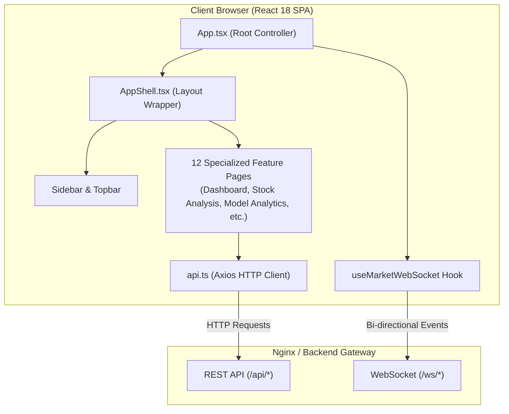

# Enterprise Stock Intelligence Platform — Frontend Architecture & UI Design System

This document provides a comprehensive technical guide to the React 18 single-page application (SPA), UI/UX design tokens, component hierarchy, state management patterns, and real-time WebSocket integration powering the **Enterprise Stock Intelligence Platform (MarketIQ)**.

---

## 📑 Table of Contents

- [Frontend Architecture Overview](#frontend-architecture-overview)
- [Design System & CSS Token Architecture](#design-system--css-token-architecture)
  - [Color Palette & Semantic Tokens](#color-palette--semantic-tokens)
  - [Typography & Elevational Shadows](#typography--elevational-shadows)
- [Component Hierarchy & Shell Layout](#component-hierarchy--shell-layout)
- [Page Catalog & Functional Breakdown](#page-catalog--functional-breakdown)
  - [1. Dashboard (`/`)](#1-dashboard-)
  - [2. Market Overview](#2-market-overview)
  - [3. Stock Analysis](#3-stock-analysis)
  - [4. Predictions](#4-predictions)
  - [5. Technical Analysis](#5-technical-analysis)
  - [6. Model Analytics](#6-model-analytics)
  - [7. Prediction History](#7-prediction-history)
  - [8. Market Data](#8-market-data)
  - [9. Data Quality & Drift](#9-data-quality--drift)
  - [10. System Health](#10-system-health)
  - [11. Background Jobs](#11-background-jobs)
  - [12. Settings](#12-settings)
- [Real-Time WebSocket Integration (`useMarketWebSocket`)](#real-time-websocket-integration-usemarketwebsocket)
- [API Client & Error Handling (`services/api.ts`)](#api-client--error-handling-servicesapits)
- [Build, Packaging & Nginx Serving](#build-packaging--nginx-serving)

---

## 🏛 Frontend Architecture Overview

The frontend is built with **React 18**, **TypeScript**, and **Vite 5**, designed around an enterprise-grade fintech aesthetic. It avoids generic dark themes or plain monochromatic designs in favor of a clean, subtle cool blue-gray canvas (`#F4F7FB`), crisp white elevated cards (`#FFFFFF`), and high-contrast semantic accents for financial signals.



---

## 🎨 Design System & CSS Token Architecture

The design system is defined in `frontend/src/index.css` using CSS custom properties. It enforces strict color contrast, accessible typography, and intuitive financial directionality.

### Color Palette & Semantic Tokens

```css
:root {
  /* 1. Main Backgrounds: Layered FinTech System */
  --bg-main: #F4F7FB;         /* Subtle cool blue-gray workspace */
  --bg-secondary: #EEF3F8;    /* Secondary container tint */

  /* 2. Surfaces & Tints: Clean White Cards */
  --surface: #FFFFFF;
  --bg-card: #FFFFFF;
  --bg-card-hover: #F8FAFC;
  --border-card: #DCE4EE;

  /* 3. Primary & Accent Colors */
  --color-primary: #2563EB;   /* Vibrant Royal Blue (Primary actions) */
  --color-secondary: #4F46E5; /* Indigo (Secondary metrics) */
  --color-purple: #7C3AED;    /* Purple (AI & Model features) */
  --color-teal: #0D9488;      /* Teal (Data quality & drift) */
  --color-cyan: #0891B2;      /* Cyan (System diagnostics) */

  /* 4. Directional Financial Semantics */
  --color-up: #16A34A;        /* Green: Bullish / Positive Return / Correct */
  --color-up-bg: #F0FDF4;     /* Soft green badge background */
  --color-up-border: #BBF7D0;

  --color-down: #DC2626;      /* Red: Bearish / Negative Return / Incorrect */
  --color-down-bg: #FEF2F2;   /* Soft red badge background */
  --color-down-border: #FECACA;

  --color-warn: #EA580C;      /* Orange: Moderate Drift / Pending / Warning */
  --color-warn-bg: #FFF7ED;

  /* 5. High-Contrast Typography */
  --text-primary: #172033;   /* Slate 900: High-contrast headings */
  --text-body: #334155;      /* Slate 700: Body copy */
  --text-secondary: #64748B; /* Slate 600: Subtitles, labels */
  --text-muted: #94A3B8;     /* Slate 400: Timestamps, captions */
}
```

### Typography & Elevational Shadows

- **Font Families**:
  - Primary UI: `Inter`, system-ui, -apple-system, sans-serif
  - Monospace / Financial Numbers: `JetBrains Mono`, `Roboto Mono`, monospace
- **Elevation**:
  - Card Shadow: `0 1px 3px 0 rgba(0, 0, 0, 0.05), 0 1px 2px -1px rgba(0, 0, 0, 0.05)`
  - Elevated Popover / Modal: `0 10px 15px -3px rgba(0, 0, 0, 0.08), 0 4px 6px -4px rgba(0, 0, 0, 0.04)`

---

## 📐 Component Hierarchy & Shell Layout

The application utilizes a persistent frame (`AppShell`) wrapping dynamic feature views:

```
App.tsx (Root Controller & Global State)
├── AppShell.tsx
│   ├── Topbar
│   │   ├── Brand Logo ("MarketIQ")
│   │   ├── Stock Selector Dropdown (TCS.NS, RELIANCE.NS, INFY.NS, HDFCBANK.NS)
│   │   ├── System Status Indicator Pill (API, DB, Redis, Celery, WS)
│   │   ├── Live UTC Clock
│   │   ├── Refresh Data Trigger
│   │   └── Auth / Login Trigger
│   ├── Sidebar Navigation (12 Sections with Lucide Icons)
│   └── Main Content Container (Active Page Rendered)
└── LoginModal (Conditionally rendered)
```

---

## 📄 Page Catalog & Functional Breakdown

### 1. Dashboard (`/`)
- **File**: `frontend/src/pages/Dashboard.tsx`
- **Purpose**: Executive overview of the selected stock ticker.
- **Key Components**:
  - **Prediction Hero Banner**: Directional badge (`UP` in green or `DOWN` in red), confidence probability percentage, and model version.
  - **Probability Distribution Bar**: Visual split between `UP` and `DOWN` class probabilities.
  - **Mini Price & Volume Chart**: 30-day recent price trajectory rendered with Recharts.
  - **Quick Stats**: Realized 24h change, high/low spread, and latest trade volume.

### 2. Market Overview
- **File**: `frontend/src/pages/MarketOverview.tsx`
- **Purpose**: Macro comparison across all 4 tracked universe stocks (`TCS.NS`, `RELIANCE.NS`, `INFY.NS`, `HDFCBANK.NS`).
- **Features**: Real-time price grid, percentage gainers/losers, exchange status, and volume leaders.

### 3. Stock Analysis
- **File**: `frontend/src/pages/StockAnalysis.tsx`
- **Purpose**: In-depth quantitative inspection of an individual asset.
- **Features**:
  - Interactive multi-timeframe selector (`1D`, `5D`, `1M`, `3M`, `6M`, `1Y`).
  - Candlestick / Area price chart with dual-axis trading volume bars.
  - Valuation metrics: 52-week high, 52-week low, average daily volume, and beta.

### 4. Predictions
- **File**: `frontend/src/pages/Predictions.tsx`
- **Purpose**: Deep-dive into active model predictions.
- **Features**:
  - Inference timestamp and underlying bar timestamp.
  - Prediction confidence interval gauge.
  - 12-feature snapshot showing exact numerical inputs evaluated during inference.

### 5. Technical Analysis
- **File**: `frontend/src/pages/TechnicalAnalysis.tsx`
- **Purpose**: Visual technical indicators calculated dynamically over historical bars.
- **Features**:
  - Simple Moving Averages (`SMA 10`, `SMA 20`, `SMA 50`).
  - Exponential Moving Averages (`EMA 12`, `EMA 26`).
  - Moving Average Convergence Divergence (`MACD` line, `Signal` line, and `Histogram`).
  - Relative Strength Index (`RSI 14`) with overbought ($70$) and oversold ($30$) threshold bands.

### 6. Model Analytics
- **File**: `frontend/src/pages/ModelAnalytics.tsx`
- **Purpose**: Comprehensive ML model governance, validation performance, and interpretability.
- **Features**:
  - Model Registry card (active algorithm, version, status, promotion date).
  - Validation metrics table: Accuracy, Precision, Recall, F1-Score, ROC-AUC, Log-Loss.
  - $2 \times 2$ Confusion Matrix (True Positive, False Positive, True Negative, False Negative).
  - Feature Importance horizontal bar chart displaying normalized XGBoost gain weights.

### 7. Prediction History
- **File**: `frontend/src/pages/PredictionHistory.tsx`
- **Purpose**: Historical ledger of past inferences and their realized real-world accuracy.
- **Features**:
  - Paginated table showing: Prediction Date, Symbol, Predicted Direction, Confidence, Realized Direction, Realized Return, and Outcome (`CORRECT`, `INCORRECT`, `PENDING`).
  - Filterable by symbol and outcome status.
  - Cumulative directional hit-rate indicator.

### 8. Market Data
- **File**: `frontend/src/pages/MarketData.tsx`
- **Purpose**: Raw tabular ledger of stored OHLCV price bars.
- **Features**: UTC timestamp, Open, High, Low, Close, Volume, and Data Provider Source (`yfinance`).

### 9. Data Quality & Drift
- **File**: `frontend/src/pages/DataQuality.tsx`
- **Purpose**: Continuous statistical monitoring of input feature integrity and distribution shifts.
- **Features**:
  - Population Stability Index (PSI) score per feature.
  - Drift severity badges: Low ($PSI < 0.1$), Moderate ($0.1 \le PSI < 0.25$), High ($PSI \ge 0.25$).
  - Missing value percentage, zero-variance checks, and outlier detection.

### 10. System Health
- **File**: `frontend/src/pages/SystemHealth.tsx`
- **Purpose**: Operational dashboard for infrastructure health.
- **Features**: Live status probes for Django REST API, PostgreSQL database connection, Redis broker, Celery worker pool, and Model Registry.

### 11. Background Jobs
- **File**: `frontend/src/pages/BackgroundJobs.tsx`
- **Purpose**: Inspection of Celery periodic schedules and background task queue states.
- **Features**: Last run time, next scheduled run, task duration, and execution success rate.

### 12. Settings
- **File**: `frontend/src/pages/Settings.tsx`
- **Purpose**: Application configuration, API URL overrides, and user session management.

---

## ⚡ Real-Time WebSocket Integration (`useMarketWebSocket`)

Real-time streaming is implemented via the custom hook `frontend/src/hooks/useMarketWebSocket.ts`:

```typescript
// Subscribes to stock-specific WebSocket channel
const { connectionStatus, lastEvent } = useMarketWebSocket(currentSymbol);
```

### Key Features:
1. **Auto-Reconnection**: Reconnects automatically with exponential backoff (1s, 2s, 4s, up to 30s) on disconnection.
2. **Dynamic Symbol Switching**: Unsubscribes from the previous ticker group and subscribes to the newly selected symbol without tearing down the underlying socket connection.
3. **Optimistic State Updates**: Updates live price and prediction history immediately upon receiving a broadcast event before the periodic 45-second HTTP polling cycle occurs.

---

## 🌐 API Client & Error Handling (`services/api.ts`)

All REST interactions pass through a centralized API service using Axios:

- **Base URL**: `/api` (proxied via Nginx to Django backend).
- **Custom `ApiError` Class**: Normalizes backend HTTP status codes, structured JSON error bodies, and network timeouts into human-readable messages.
- **Safe Fallbacks**: Endpoints return structured fallback objects on `404 Not Found` or `422 Unprocessable Entity` to prevent frontend blank screens.

---

## 📦 Build, Packaging & Nginx Serving

The frontend uses a multi-stage Docker build:

```dockerfile
# Stage 1: Deterministic Build
FROM node:20-alpine AS builder
WORKDIR /app
COPY package.json package-lock.json ./
RUN npm ci
COPY . .
RUN npm run build

# Stage 2: Production Nginx Delivery
FROM nginx:1.25-alpine AS runner
COPY --from=builder /app/dist /usr/share/nginx/html
COPY nginx.conf /etc/nginx/conf.d/default.conf
EXPOSE 80
CMD ["nginx", "-g", "daemon off;"]
```

The internal Nginx instance includes a single-page app rewrite rule:
```nginx
location / {
    try_files $uri $uri/ /index.html;
}
```
This ensures client-side routing functions correctly across page refreshes and direct URL navigation.

