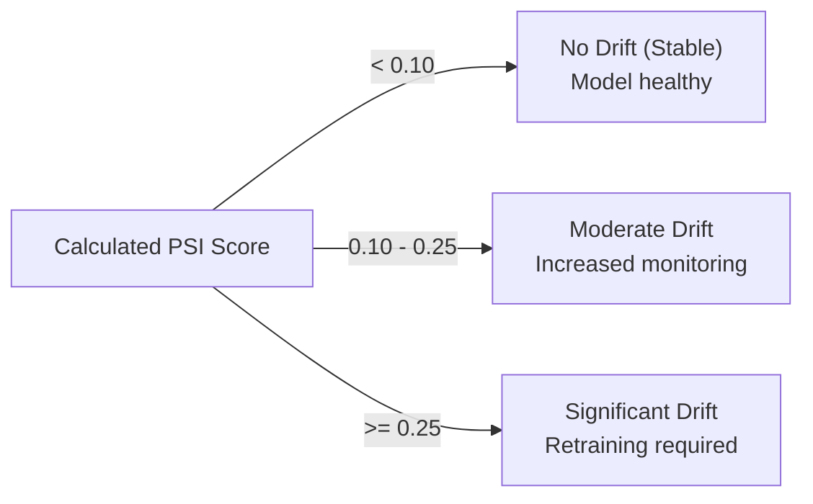

# Enterprise Stock Intelligence Platform — Machine Learning Pipeline

This document provides complete documentation of the quantitative financial modeling, feature engineering mathematics, model training methodology, inference pipeline, and production drift monitoring implemented in the **Enterprise Stock Intelligence Platform**.

---

## 📑 Table of Contents

- [Pipeline Overview](#pipeline-overview)
- [Target Variable Formulation](#target-variable-formulation)
- [Feature Engineering (12 Technical Indicators)](#feature-engineering-12-technical-indicators)
  - [1. 1-Day Return (`return_1d`)](#1-1-day-return-return_1d)
  - [2. 5-Day Return (`return_5d`)](#2-5-day-return-return_5d)
  - [3. 10-Day Simple Moving Average (`sma_10`)](#3-10-day-simple-moving-average-sma_10)
  - [4. 20-Day Simple Moving Average (`sma_20`)](#4-20-day-simple-moving-average-sma_20)
  - [5. 50-Day Simple Moving Average (`sma_50`)](#5-50-day-simple-moving-average-sma_50)
  - [6. 12-Day Exponential Moving Average (`ema_12`)](#6-12-day-exponential-moving-average-ema_12)
  - [7. 26-Day Exponential Moving Average (`ema_26`)](#7-26-day-exponential-moving-average-ema_26)
  - [8. MACD Line (`macd`)](#8-macd-line-macd)
  - [9. MACD Signal Line (`macd_signal`)](#9-macd-signal-line-macd_signal)
  - [10. 14-Day Relative Strength Index (`rsi_14`)](#10-14-day-relative-strength-index-rsi_14)
  - [11. 20-Day Rolling Volatility (`volatility_20`)](#11-20-day-rolling-volatility-volatility_20)
  - [12. Volume Change Ratio (`volume_change`)](#12-volume-change-ratio-volume_change)
- [Model Architecture & Hyperparameters](#model-architecture--hyperparameters)
- [Training Methodology & Preventing Lookahead Bias](#training-methodology--preventing-lookahead-bias)
- [Inference & Live Prediction Engine](#inference--live-prediction-engine)
- [Data Drift & Population Stability Index (PSI)](#data-drift--population-stability-index-psi)
- [Model Registry & Lifecycle Management](#model-registry--lifecycle-management)

---

## 🔬 Pipeline Overview

The machine learning pipeline predicts the **directional movement** (UP vs. DOWN) of an equity's closing price over the next trading period. The system operates as a supervised binary classification model:

$$\hat{y}_t = f(X_t) \in \{\text{UP}, \text{DOWN}\}$$

where $X_t \in \mathbb{R}^{12}$ represents the feature vector derived from historical price and volume bars up to time $t$.


---

## 🎯 Target Variable Formulation

The target variable $Y_t$ is defined as the directional sign of the forward 1-period return:

$$Y_t = \begin{cases} 1 & \text{if } P_{t+1} > P_t \quad (\text{UP}) \\ 0 & \text{if } P_{t+1} \le P_t \quad (\text{DOWN}) \end{cases}$$

Where:
- $P_t$ is the adjusted closing price at time $t$.
- $P_{t+1}$ is the closing price at the subsequent trading interval.

> [!IMPORTANT]
> The target variable $Y_t$ is strictly shifted backward during training so that feature vector $X_t$ only incorporates information available at or before time $t$. Under no circumstances is $P_{t+1}$ included in $X_t$.

---

## 📐 Feature Engineering (12 Technical Indicators)

All features are calculated programmatically in `FeatureEngineeringService` using vectorized Pandas and NumPy operations:

### 1. 1-Day Return (`return_1d`)
- **Formula**:
  $$R_{1d, t} = \frac{P_t - P_{t-1}}{P_{t-1}}$$
- **Intuition**: Captures short-term momentum and daily price shock.

### 2. 5-Day Return (`return_5d`)
- **Formula**:
  $$R_{5d, t} = \frac{P_t - P_{t-5}}{P_{t-5}}$$
- **Intuition**: Measures weekly trend momentum and medium-term price velocity.

### 3. 10-Day Simple Moving Average (`sma_10`)
- **Formula**:
  $$\text{SMA}_{10, t} = \frac{1}{10} \sum_{i=0}^{9} P_{t-i}$$
- **Intuition**: Fast moving average reflecting short-term support and resistance levels.

### 4. 20-Day Simple Moving Average (`sma_20`)
- **Formula**:
  $$\text{SMA}_{20, t} = \frac{1}{20} \sum_{i=0}^{19} P_{t-i}$$
- **Intuition**: Standard 1-month trading trend indicator; central baseline for Bollinger Bands.

### 5. 50-Day Simple Moving Average (`sma_50`)
- **Formula**:
  $$\text{SMA}_{50, t} = \frac{1}{50} \sum_{i=0}^{49} P_{t-i}$$
- **Intuition**: Intermediate trend indicator; cross of SMA-20 and SMA-50 identifies golden/death crosses.

### 6. 12-Day Exponential Moving Average (`ema_12`)
- **Formula**:
  $$\text{EMA}_{12, t} = \alpha_{12} P_t + (1 - \alpha_{12}) \text{EMA}_{12, t-1}, \quad \alpha_{12} = \frac{2}{12 + 1} \approx 0.1538$$
- **Intuition**: Weights recent prices more heavily than older prices; fast component of MACD.

### 7. 26-Day Exponential Moving Average (`ema_26`)
- **Formula**:
  $$\text{EMA}_{26, t} = \alpha_{26} P_t + (1 - \alpha_{26}) \text{EMA}_{26, t-1}, \quad \alpha_{26} = \frac{2}{26 + 1} \approx 0.0741$$
- **Intuition**: Slower trend-following exponential average; slow component of MACD.

### 8. MACD Line (`macd`)
- **Formula**:
  $$\text{MACD}_t = \text{EMA}_{12, t} - \text{EMA}_{26, t}$$
- **Intuition**: Quantifies convergence and divergence between short-term and medium-term momentum.

### 9. MACD Signal Line (`macd_signal`)
- **Formula**:
  $$\text{Signal}_t = \text{EMA}_9(\text{MACD})_t = \alpha_9 \text{MACD}_t + (1 - \alpha_9) \text{Signal}_{t-1}, \quad \alpha_9 = \frac{2}{9 + 1} = 0.2$$
- **Intuition**: 9-day EMA smoothing of the MACD line; crossovers generate directional buy/sell signals.

### 10. 14-Day Relative Strength Index (`rsi_14`)
- **Formula**:
  $$\Delta P_t = P_t - P_{t-1}$$
  $$U_t = \max(\Delta P_t, 0), \quad D_t = \max(-\Delta P_t, 0)$$
  $$\text{AvgGain}_{14, t} = \frac{1}{14} \sum_{i=0}^{13} U_{t-i}, \quad \text{AvgLoss}_{14, t} = \frac{1}{14} \sum_{i=0}^{13} D_{t-i}$$
  $$\text{RS}_t = \frac{\text{AvgGain}_{14, t}}{\text{AvgLoss}_{14, t}}$$
  $$\text{RSI}_{14, t} = 100 - \left( \frac{100}{1 + \text{RS}_t} \right)$$
- **Intuition**: Bounded oscillator ($[0, 100]$) measuring overbought ($\text{RSI} > 70$) and oversold ($\text{RSI} < 30$) conditions.

### 11. 20-Day Rolling Volatility (`volatility_20`)
- **Formula**:
  $$\sigma_{20, t} = \sqrt{\frac{1}{19} \sum_{i=0}^{19} \left( R_{1d, t-i} - \bar{R}_{1d} \right)^2}$$
- **Intuition**: Measures market dispersion and regime risk over the preceding 20 trading sessions.

### 12. Volume Change Ratio (`volume_change`)
- **Formula**:
  $$\Delta V_t = \frac{V_t - V_{t-1}}{V_{t-1}}$$
- **Intuition**: Identifies unusual institutional volume spikes validating or invalidating price trends.

---

## 🌲 Model Architecture & Hyperparameters

The primary model is an **XGBoost Classifier** (`xgboost.XGBClassifier`), an optimized gradient-boosted decision tree algorithm chosen for its efficiency, resistance to collinearity, and strong performance on tabular time-series features.

### Hyperparameter Configuration

| Parameter | Value | Rationale |
|---|---|---|
| `n_estimators` | `100` | Sufficient ensemble capacity while mitigating overfitting |
| `max_depth` | `3` | Shallow trees to prevent memorizing financial noise |
| `learning_rate` | `0.05` | Conservative shrinkage factor for gradual gradient descent |
| `subsample` | `0.8` | Row subsampling per tree to introduce bagging variance reduction |
| `colsample_bytree`| `0.8` | Feature subsampling to prevent single-feature dominance |
| `gamma` | `0.1` | Minimum loss reduction required to make a further partition |
| `objective` | `binary:logistic` | Standard logistic regression for binary classification |
| `eval_metric` | `logloss` | Cross-entropy loss for probability calibration |

---

## ⏳ Training Methodology & Preventing Lookahead Bias

Standard $k$-fold cross-validation is **invalid** for financial time series because shuffling records introduces lookahead bias (training on future data to predict the past).

### Strict Sequential Split

1. **Chronological Ordering**: The dataset is sorted strictly by `timestamp ASC`.
2. **Train/Test Partition**:
   - **Training Set**: Earliest 80% of historical market bars ($t_0 \to t_{train}$).
   - **Testing Set**: Most recent 20% of historical market bars ($t_{train+1} \to t_{end}$).
3. **No Leakage**:
   - Rolling features at index $i$ only reference indices $\le i$.
   - The first 50 rows of data are dropped (`df.dropna()`) to account for the longest indicator warmup period (`sma_50`).

---

## ⚡ Inference & Live Prediction Engine

The inference workflow is managed by `PredictionService`:

1. **Input Normalization**: Ticker symbol is normalized (`tcs.ns` $\to$ `TCS.NS`).
2. **Artifact Retrieval**: The model artifact (`.joblib`) and metadata (`_metadata.json`) are retrieved from `ml/models/artifacts/` using an in-memory LRU cache.
3. **Feature Construction**: `FeatureEngineeringService.create_features` computes the latest feature vector from the most recent 60 `MarketPrice` bars.
4. **Validation**: The feature row is verified to contain zero `NaN` or `inf` values. If fewer than 50 records exist, an `InsufficientDataError` is raised.
5. **Inference**:
   $$\hat{p} = \text{model.predict\_proba}(X_{\text{latest}})[1]$$
   - $\hat{p} \ge 0.5 \implies \text{UP}$ (Direction 1)
   - $\hat{p} < 0.5 \implies \text{DOWN}$ (Direction 0)
6. **Persistence**: Idempotently written to `predictions_prediction` table.

---

## 📊 Data Drift & Population Stability Index (PSI)

In financial machine learning, market regime shifts (e.g., changes from low-volatility bull runs to high-volatility bear markets) degrade model predictive power.

### Mathematical Formulation of PSI

For a given feature $f$, the training distribution (baseline) and live inference distribution (actual) are partitioned into $B = 10$ quantile bins:

$$\text{PSI}_f = \sum_{k=1}^{B} \left( \text{Actual}_k - \text{Expected}_k \right) \times \ln\left( \frac{\text{Actual}_k}{\text{Expected}_k} \right)$$

Where:
- $\text{Expected}_k$: Percentage of training records in bin $k$.
- $\text{Actual}_k$: Percentage of live production records in bin $k$.
- A smoothing constant ($\epsilon = 10^{-4}$) is applied to avoid division by zero or $\ln(0)$.

The overall **Model PSI** is the average across all 12 features:

$$\text{PSI}_{\text{model}} = \frac{1}{12} \sum_{j=1}^{12} \text{PSI}_{f_j}$$

### Threshold Interpretation



| PSI Range | Status | Action Required |
|---|---|---|
| $\text{PSI} < 0.10$ | `NO_DRIFT` | None. Distributions are consistent. |
| $0.10 \le \text{PSI} < 0.25$ | `MODERATE_DRIFT` | Warning. Monitor feature shifts and accuracy degradation. |
| $\text{PSI} \ge 0.25$ | `SIGNIFICANT_DRIFT` | Critical. Schedule model retraining on recent market regimes. |

---

## 📦 Model Registry & Lifecycle Management

### Directory Layout
```text
ml/models/artifacts/
├── xgboost_classifier_TCS_NS_v1.joblib
├── xgboost_classifier_TCS_NS_v1_metadata.json
├── xgboost_classifier_TCS_NS_v2.joblib
└── xgboost_classifier_TCS_NS_v2_metadata.json
```

### Metadata Contract (`_metadata.json`)
```json
{
  "symbol": "TCS.NS",
  "model_type": "xgboost_classifier",
  "model_version": "v1",
  "features": [
    "return_1d", "return_5d", "sma_10", "sma_20", "sma_50",
    "ema_12", "ema_26", "macd", "macd_signal", "rsi_14",
    "volatility_20", "volume_change"
  ],
  "metrics": {
    "accuracy": 0.54,
    "balanced_accuracy": 0.53,
    "precision": 0.55,
    "recall": 0.62,
    "f1": 0.58,
    "roc_auc": 0.56
  },
  "created_at": "2026-09-20T18:30:00+00:00"
}
```

### Zero-Downtime Model Switching
The platform supports dynamic model version switching via `/api/predictions/<symbol>/versions/`:
- Changing the active version invalidates the internal memory cache (`PredictionService.invalidate_model_cache(symbol)`).
- Subsequent predictions immediately utilize the newly selected model artifact without restarting backend containers.

