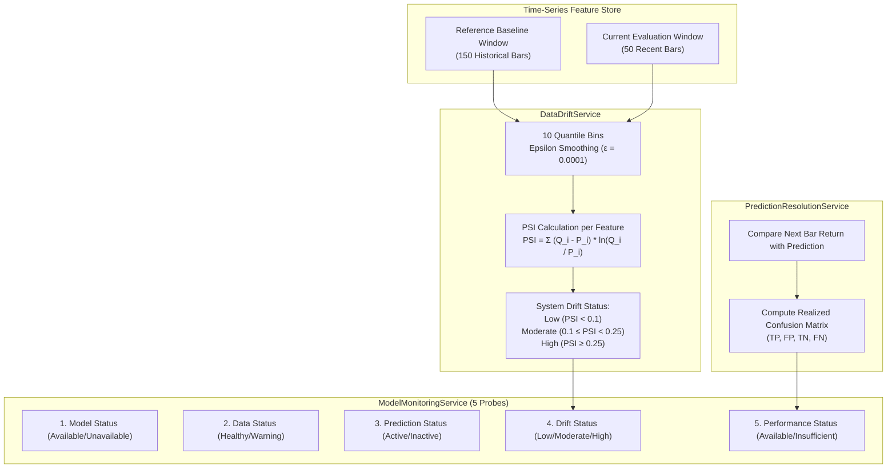
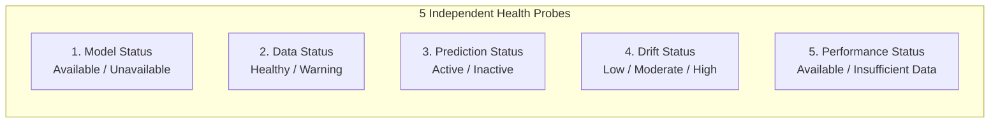

# Enterprise Stock Intelligence Platform — Model Monitoring & Data Drift Architecture

This document provides a comprehensive technical specification for the production ML monitoring, feature distribution drift tracking, statistical stability index, and operational health probes powering the **Enterprise Stock Intelligence Platform (MarketIQ)**.

---

## 📑 Table of Contents

- [Monitoring Architecture Overview](#monitoring-architecture-overview)
- [Population Stability Index (PSI) Drift Engine](#population-stability-index-psi-drift-engine)
  - [Mathematical Formulation](#mathematical-formulation)
  - [Quantile Binning & Smoothing](#quantile-binning--smoothing)
  - [Drift Severity Thresholds](#drift-severity-thresholds)
- [Feature Drift Evaluation Matrix](#feature-drift-evaluation-matrix)
- [Executive Monitoring Probes (5 Independent Indicators)](#executive-monitoring-probes-5-independent-indicators)
- [Performance Tracking & Realized Confusion Matrix](#performance-tracking--realized-confusion-matrix)
- [Data Quality & Feature Store Health](#data-quality--feature-store-health)
- [REST API Monitoring Endpoints](#rest-api-monitoring-endpoints)

---

## 🏛 Monitoring Architecture Overview

Machine learning models deployed on financial time-series face non-stationary market regimes, volatility spikes, and structural economic shifts. Unlike static evaluation on test sets, **continuous production monitoring** tracks whether incoming market data still conforms to the training distribution and whether prediction accuracy is decaying over time.

---

## 📈 Population Stability Index (PSI) Drift Engine

### Mathematical Formulation

The platform utilizes the **Population Stability Index (PSI)** to quantify shifts in the probability distribution of each numerical feature between a reference baseline dataset ($P$) and a current production evaluation dataset ($Q$):

$$PSI = \sum_{i=1}^{k} \left( Q_i - P_i \right) \times \ln\left( \frac{Q_i}{P_i} \right)$$

Where:
- $k$: Number of bins ($k = 10$).
- $P_i$: Proportion of observations in bin $i$ from the **reference baseline** (historical 150 days).
- $Q_i$: Proportion of observations in bin $i$ from the **current window** (recent 50 days).
- $\ln(\cdot)$: Natural logarithm.

### Quantile Binning & Smoothing

To guarantee robust calculation across non-normal distributions (e.g. heavy-tailed financial returns):

1. **Quantile Bin Edges**:
   - Bin edges are computed from the reference distribution percentiles:
     $$\text{edges} = \text{percentile}(P_{\text{valid}}, [0, 10, 20, \dots, 100])$$
   - Minimum jitter ($\Delta = 10^{-6}$) is added to duplicate bin edges to ensure strictly monotonic intervals.
   - Outer edges are expanded to $[-\infty, +\infty]$ to capture out-of-distribution extremes without raising out-of-bounds errors.

2. **Epsilon Smoothing**:
   - Zero-frequency bins are smoothed with $\epsilon = 0.0001$ to prevent division-by-zero or $\ln(0)$ errors:
     $$P_i = \max\left(\frac{N_{P, i}}{N_P}, \epsilon\right), \quad Q_i = \max\left(\frac{N_{Q, i}}{N_Q}, \epsilon\right)$$
   - Proportions are normalized such that $\sum P_i = 1$ and $\sum Q_i = 1$.

### Drift Severity Thresholds

Following banking and quantitative risk standards:

| PSI Score Range | Drift Severity | System Interpretation & Recommended Action |
| :--- | :--- | :--- |
| **$PSI < 0.10$** | **Low / Negligible** | Feature distribution is stable. Model predictions are reliable; no retraining required. |
| **$0.10 \le PSI < 0.25$** | **Moderate** | Feature distribution is shifting. Increased monitoring recommended; schedule automated retraining. |
| **$PSI \ge 0.25$** | **High / Critical** | Significant population drift detected. Model assumptions may no longer hold; trigger immediate retraining. |

---

## 📊 Feature Drift Evaluation Matrix

All 12 production features are continuously tracked and assigned individual PSI scores:

| Feature Name | Category | Primary Sensitivity | Typical Drift Triggers |
| :--- | :--- | :--- | :--- |
| `return_1d` | Momentum | Short-term price shocks | Earnings announcements, macroeconomic news |
| `return_5d` | Momentum | Medium-term momentum | Multi-day trend reversals |
| `sma_10` | Trend | Short-term baseline | Sudden breakouts |
| `sma_20` | Trend | Monthly baseline | Medium-term trend exhaustion |
| `sma_50` | Trend | Quarterly baseline | Regime shifts (bull $\to$ bear market) |
| `ema_12` | Trend | Fast trend weighting | Sudden trend changes |
| `ema_26` | Trend | Slow trend weighting | Sustained rallies or selloffs |
| `macd` | Trend & Momentum | Oscillator spread | Momentum divergence |
| `macd_signal` | Trend & Momentum | Signal line | Whipsaw markets |
| `rsi_14` | Oscillator | Overbought/Oversold bounds | Extended trending cycles ($> 70$ or $< 30$) |
| `volatility_20` | Volatility | 20-day standard deviation | High volatility regimes, VIX spikes |
| `volume_change` | Liquidity | Volume spikes | Institutional block deals, quarterly results |

---

## 🩺 Executive Monitoring Probes (5 Independent Indicators)

The `ModelMonitoringService.get_summary()` endpoint aggregates operational health across 5 decoupled indicators:

1. **Model Status (`model_status`)**:
   - **`Available`**: Active `production` version exists in `model_versions` registry with valid `.joblib` and `.json` artifacts on disk.
   - **`Unavailable`**: Model artifact missing or corrupted.
2. **Data Status (`data_status`)**:
   - **`Healthy`**: $\ge 50$ historical daily bars persisted in PostgreSQL (sufficient for feature calculation).
   - **`Warning`**: $1 \le \text{bars} < 50$ (insufficient for full 50-day SMA).
   - **`Unavailable`**: 0 bars found.
3. **Prediction Status (`prediction_status`)**:
   - **`Active`**: At least 1 persisted inference record exists for the ticker.
   - **`Inactive`**: Zero predictions recorded.
4. **Drift Status (`drift_status`)**:
   - Evaluated as the maximum drift across all 12 features (`Low`, `Moderate`, or `High`).
5. **Performance Status (`performance_status`)**:
   - **`Available`**: At least one prediction outcome has been resolved against realized market prices.
   - **`Insufficient Data`**: All predictions are still `PENDING`.

---

## 🎯 Performance Tracking & Realized Confusion Matrix

When a trading session completes, Celery's `resolve_pending_predictions_task` compares predictions against actual next-day returns. The realized performance is evaluated as a $2 \times 2$ classification confusion matrix:

| Actual Realized Direction $\backslash$ Predicted Label | Predicted **DOWN** ($\hat{y} = 0$) | Predicted **UP** ($\hat{y} = 1$) |
| :---: | :---: | :---: |
| **Actual DOWN** ($y = 0$) | **True Negative (TN)** | **False Positive (FP)** |
| **Actual UP** ($y = 1$) | **False Negative (FN)** | **True Positive (TP)** |

### Classification Formulas

$$\text{Accuracy} = \frac{TP + TN}{TP + TN + FP + FN}$$

$$\text{Precision} = \frac{TP}{TP + FP}, \quad \text{Recall} = \frac{TP}{TP + FN}$$

$$\text{F1-Score} = 2 \times \frac{\text{Precision} \times \text{Recall}}{\text{Precision} + \text{Recall}}$$

$$\text{Balanced Accuracy} = \frac{1}{2} \left( \frac{TP}{TP + FN} + \frac{TN}{TN + FP} \right)$$

---

## 🧹 Data Quality & Feature Store Health

Located at `GET /api/model-monitoring/<symbol>/data-quality/`, automated audits verify data integrity before inference:

1. **Time-Series Completeness**: Confirms total observations in PostgreSQL $\ge 50$ bars.
2. **Chronological Uniqueness**: Confirms zero duplicate timestamp collisions via composite unique constraint `(stock_id, timestamp, timeframe, source)`.
3. **Feature Completeness**: Asserts all 12 mathematical technical indicators can be computed without missing values.
4. **Zero-Variance Detection**: Flags any constant feature that provides zero predictive signal.

---

## 🔌 REST API Monitoring Endpoints

| Method | Endpoint | Description |
| :--- | :--- | :--- |
| `GET` | `/api/model-monitoring/<symbol>/summary/` | Executive dashboard with 5 independent health probes. |
| `GET` | `/api/model-monitoring/<symbol>/performance/?period=30D` | Realized confusion matrix, accuracy, precision, recall, and F1. |
| `GET` | `/api/model-monitoring/<symbol>/drift/` | PSI score per feature and overall drift classification. |
| `GET` | `/api/model-monitoring/<symbol>/data-quality/` | Total observations, date ranges, missing value counts, and data health checks. |
| `GET` | `/api/predictions/<symbol>/analytics/` | Model registry info, feature importances, and validation metrics. |

