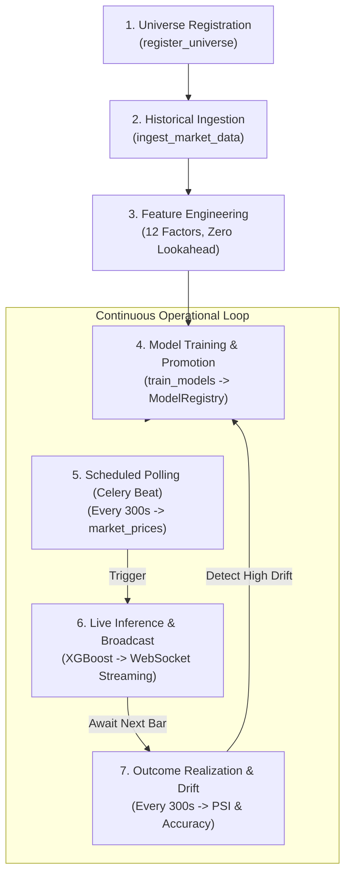
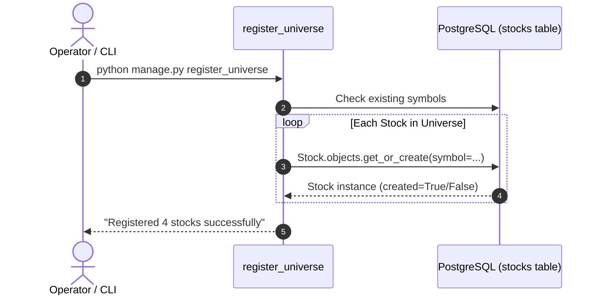
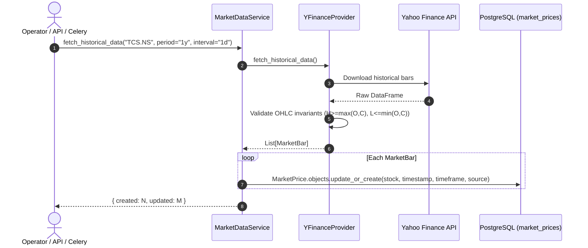
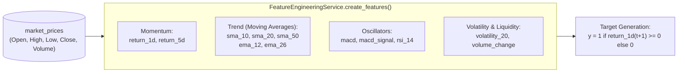
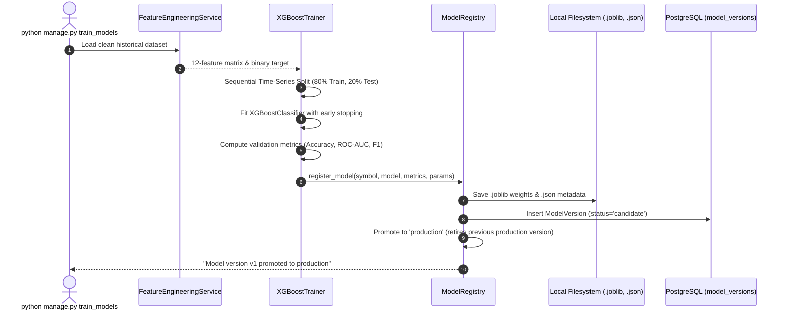
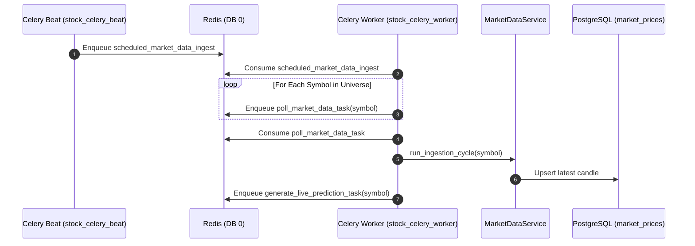
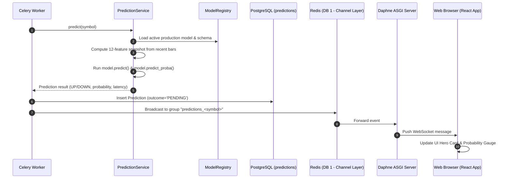
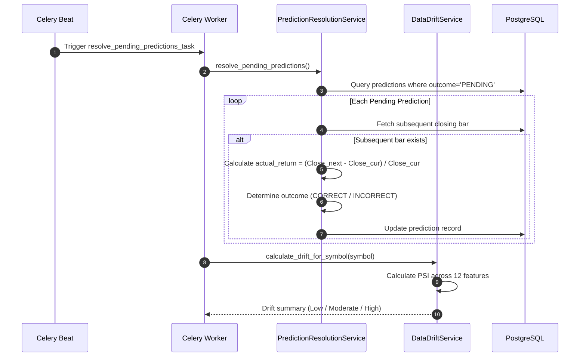

# Enterprise Stock Intelligence Platform — End-to-End Project Workflows

This document provides a detailed operational breakdown of the 7 primary end-to-end workflows governing the lifecycle of data, machine learning models, inferences, and monitoring in the **Enterprise Stock Intelligence Platform (MarketIQ)**.

---

## 📑 Table of Contents

- [Lifecycle Overview](#lifecycle-overview)
- [Workflow 1: Universe Registration & Asset Onboarding](#workflow-1-universe-registration--asset-onboarding)
- [Workflow 2: Historical Market Data Ingestion](#workflow-2-historical-market-data-ingestion)
- [Workflow 3: Feature Engineering & Technical Indicators Pipeline](#workflow-3-feature-engineering--technical-indicators-pipeline)
- [Workflow 4: Model Training, Evaluation & Registry Promotion](#workflow-4-model-training-evaluation--registry-promotion)
- [Workflow 5: Scheduled Market Polling & Ingestion Cycle](#workflow-5-scheduled-market-polling--ingestion-cycle)
- [Workflow 6: Live Prediction Inference & WebSocket Event Broadcasting](#workflow-6-live-prediction-inference--websocket-event-broadcasting)
- [Workflow 7: Prediction Outcome Realization & Drift Monitoring](#workflow-7-prediction-outcome-realization--drift-monitoring)
- [Operational Runbook & Command Quick-Reference](#operational-runbook--command-quick-reference)

---

## 🔄 Lifecycle Overview



---

## 🏁 Workflow 1: Universe Registration & Asset Onboarding

### Description
Populates the `stocks` relational table with the official tracking universe (`TCS.NS`, `RELIANCE.NS`, `INFY.NS`, `HDFCBANK.NS`), configuring exchange codes, industry sectors, and active tracking flags.

### Sequence


- **Trigger**: Initial deployment or administrator expansion.
- **Idempotency**: Uses `Stock.objects.get_or_create(symbol=...)` on unique column `symbol`.

---

## 📥 Workflow 2: Historical Market Data Ingestion

### Description
Retrieves 1–2 years of daily OHLCV candlestick bars from external providers (`yfinance`), validates structural candle invariants, and persists bars to `market_prices`.

### Sequence


- **Invariants Checked**: $H \ge \max(O,C)$, $L \le \min(O,C)$, $O > 0$, $C > 0$, $V \ge 0$.
- **Idempotency**: Enforced by PostgreSQL unique constraint `unique_market_price`.

---

## ⚙️ Workflow 3: Feature Engineering & Technical Indicators Pipeline

### Description
Transforms raw OHLCV price series into a normalized 12-feature quantitative dataset for model training and live inference without lookahead bias.

### Data Transformation Pipeline


- **Feature Consistency**: Guarantees identical formula implementations in training (`ml/training/`) and live inference (`ml/inference/`).
- **Lookahead Bias Prevention**: Features at time $t$ only consume data up to and including candle $t$. Target $y_t$ is strictly shifted by 1 period into the future.

---

## 🧠 Workflow 4: Model Training, Evaluation & Registry Promotion

### Description
Executes sequential time-series training of the XGBoost classifier, evaluates performance across splits, generates confusion matrices, and registers model artifacts into `model_versions`.

### Sequence


- **Artifacts Created**:
  - `ml/models/artifacts/xgboost_classifier_<SYMBOL>_<VERSION>.joblib`
  - `ml/models/artifacts/xgboost_classifier_<SYMBOL>_<VERSION>.json`

---

## ⏰ Workflow 5: Scheduled Market Polling & Ingestion Cycle

### Description
Every 300 seconds (5 minutes), Celery Beat triggers an automated polling cycle across the universe, fetching the latest market bar and queuing real-time inference.

### Sequence


- **Frequency**: Configurable via `MARKET_DATA_INGEST_INTERVAL_SECONDS` (default: 300s).

---

## ⚡ Workflow 6: Live Prediction Inference & WebSocket Event Broadcasting

### Description
Computes real-time directional prediction for the latest price bar, records the inference in PostgreSQL, and pushes the event to connected browser clients over WebSockets.

### Sequence


- **Latency**: Sub-10ms model inference; end-to-end WebSocket delivery $< 50\text{ ms}$.

---

## 🎯 Workflow 7: Prediction Outcome Realization & Drift Monitoring

### Description
Evaluates pending predictions against subsequent market price bars, computes realized returns and confusion matrix counts, and evaluates Population Stability Index (PSI) drift across all features.

### Sequence


---

## 🛠 Operational Runbook & Command Quick-Reference

### Complete End-to-End Bootstrap from Clean State

```bash
# 1. Start all 7 Docker containers
docker compose up -d --build

# 2. Register stock universe in PostgreSQL
docker compose exec backend python manage.py register_universe

# 3. Ingest 1 year of historical market data
docker compose exec backend python manage.py ingest_market_data --period 1y --interval 1d

# 4. Train and promote XGBoost models to production registry
docker compose exec backend python manage.py train_models --symbols TCS.NS,RELIANCE.NS,INFY.NS,HDFCBANK.NS

# 5. Generate initial live predictions
docker compose exec backend python manage.py generate_predictions

# 6. Verify production readiness and health checks
docker compose exec backend python manage.py verify_production_readiness

# 7. Run full automated test suite
docker compose exec backend python manage.py test
```

