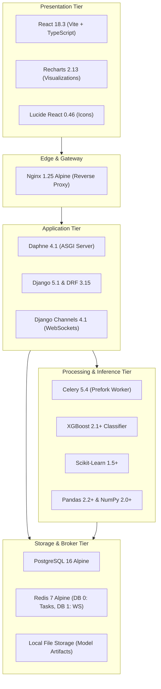

# Technology Stack & Dependency Catalog

This document details every technology, framework, database, task engine, machine learning library, and client-side tool utilized within the **MarketIQ — Enterprise Stock Price Prediction & Market Intelligence Platform**.

---

## 📑 Table of Contents

- [Architectural Overview](#architectural-overview)
- [Backend Infrastructure](#backend-infrastructure)
- [Machine Learning & Data Science](#machine-learning--data-science)
- [Persistence & In-Memory Stores](#persistence--in-memory-stores)
- [Asynchronous Task Processing](#asynchronous-task-processing)
- [Frontend Architecture & UI](#frontend-architecture--ui)
- [Containerization & Gateway](#containerization--gateway)
- [Development, Testing & Tooling](#development-testing--tooling)

---

## 🏛️ Architectural Overview

The platform implements a containerized, event-driven multi-tier architecture designed for high availability, low inference latency, and strict data science reproducibility.

---

## 🐍 Backend Infrastructure

### 1. Python Runtime
- **Version**: `Python 3.12-slim`
- **Rationale**: Modern Python 3.12 provides substantial performance improvements in interpreter execution speed, specialized bytecode handling, and robust type hint syntax.

### 2. Web Framework & Asynchronous Gateway
- **Django (`Django==5.1.x`)**:
  - Acts as the core application framework, providing robust ORM capabilities, database migrations, security middleware, and admin interfaces.
- **Django REST Framework (`djangorestframework==3.15.x`)**:
  - Powers all RESTful endpoints, request parsing, serialization, and standardized error envelopes.
- **Daphne (`daphne==4.1.x`)**:
  - Official ASGI server for Django Channels. Handles concurrent HTTP/1.1 requests and long-lived WebSocket connections simultaneously on port 8000.
- **Django Channels (`channels==4.1.x`) & `channels_redis==4.3.x`**:
  - Implements full-duplex WebSocket connections (`/ws/market/<symbol>/`) backed by Redis pub/sub channel layers.
- **Django CORS Headers (`django-cors-headers==4.4.x`)**:
  - Manages Cross-Origin Resource Sharing headers for local development and proxied container execution.

---

## 🧠 Machine Learning & Data Science

### 1. Model Execution & Training
- **XGBoost (`xgboost==2.1.x` / `3.4.x`)**:
  - The core production machine learning algorithm. Implements gradient boosted decision trees optimized for structured financial tabular time-series data.
  - Generates binary directional probabilities ($P(\text{UP}) \in [0, 1]$) with strict sequential time-series training splits.
- **Scikit-Learn (`scikit-learn==1.5.x` / `1.9.x`)**:
  - Powers data splitting (`TimeSeriesSplit`), performance metrics evaluation (Accuracy, Balanced Accuracy, Precision, Recall, F1-Score, ROC-AUC), and model persistence via `joblib`.
- **Joblib (`joblib==1.4.x` / `1.6.x`)**:
  - High-throughput serialization and deserialization of trained model pipelines, encoders, and decision tree weights.

### 2. Numerical Computing & Feature Engineering
- **Pandas (`pandas==2.2.x` / `3.0.x`)**:
  - Powers in-memory dataframe manipulations, rolling window computations (SMA, EMA, rolling standard deviation), and time-series date indexing.
- **NumPy (`numpy==2.0.x` / `2.5.x`)**:
  - Optimized vectorized mathematical operations for technical indicator formulas and array transformations.
- **SciPy (`scipy==1.14.x` / `1.18.x`)**:
  - Provides statistical calculations utilized in Population Stability Index (PSI) drift monitoring.

### 3. Market Data Ingestion
- **yfinance (`yfinance==0.2.x` / `1.7.x`)**:
  - Primary market data ingestion provider fetching daily EOD OHLCV bars and historical dividend/split-adjusted prices.

---

## 💾 Persistence & In-Memory Stores

### 1. Relational Database: PostgreSQL 16
- **Image**: `postgres:16-alpine`
- **Driver**: `psycopg==3.2.x` (Python PostgreSQL driver with connection pooling)
- **Role**: Relational persistence for:
  - Stock universe registry (`stocks`).
  - Historical time-series price bars (`market_prices`).
  - Auditable prediction records (`predictions`).
  - Model version registry (`model_versions`).
  - Evaluation benchmark metrics (`model_evaluations`).

### 2. In-Memory Broker & Cache: Redis 7
- **Image**: `redis:7-alpine`
- **Client**: `redis==5.0.x` / `8.1.x`
- **Role (Dual Database Partitioning)**:
  - **Database 0 (`redis://redis:6379/0`)**: Celery message queue broker and task state storage.
  - **Database 1 (`redis://redis:6379/1`)**: Django Channels channel layer for real-time pub/sub socket broadcasting.

---

## ⚡ Asynchronous Task Processing

### 1. Celery Worker (`celery==5.4.x` / `5.6.x`)
- **Architecture**: Distributed task queue using the Prefork concurrency pool.
- **Execution Model**:
  - Consumes tasks from Redis DB 0.
  - Implements bounded exponential backoff on transient errors (`countdown = 60 * 2^retries`).
  - Guaranteed idempotent deduplication on database inserts.

### 2. Celery Beat
- **Architecture**: Periodic scheduler daemon.
- **Schedules**:
  - Market data polling cycle: Every 300 seconds (`MARKET_DATA_INGEST_INTERVAL_SECONDS`).
  - Prediction outcome resolution: Every 300 seconds.

---

## 🎨 Frontend Architecture & UI

### 1. Core Framework & Build Tooling
- **React (`react==18.3.1`, `react-dom==18.3.1`)**:
  - Modern Single Page Application (SPA) utilizing functional components, custom hooks, and React reconciliation.
- **TypeScript (`typescript==~5.6.3`)**:
  - Complete static type safety across API response contracts, state management, and component props.
- **Vite (`vite==^5.4.10`)**:
  - Next-generation frontend bundler providing ultra-fast Hot Module Replacement (HMR) and optimized Rollup production builds.

### 2. Visualizations & Icons
- **Recharts (`recharts==^2.13.x` / `^3.10.x`)**:
  - Composable SVG financial charting library powering interactive price charts, volume distributions, RSI momentum, MACD histograms, and correlation matrices.
- **Lucide React (`lucide-react==^0.460.x` / `^1.47.x`)**:
  - Clean, consistent iconography across all 9 pages with uniform stroke widths and accessible visual hierarchy.

### 3. Styling & Design System
- **Custom CSS Design Tokens (`frontend/src/index.css`)**:
  - Layered light FinTech palette: `#F4F7FB` (main), `#EEF3F8` (workspace), `#FFFFFF` (cards), `#DCE4EE` (borders).
  - High-readability typography: **Inter** for UI copy, **JetBrains Mono** for numerical and monetary figures.
  - Micro-interactions: 200ms `pageEnter` transitions, active button compressions, and card hover elevations.

## 🤖 AI Market Intelligence Assistant

### 1. Dual-Provider Architecture
- **OpenAI Provider (`requests`)**:
  - Implements standard OpenAI Chat Completions API with native tool/function calling protocol (`gpt-4o-mini`).
  - Automatically executes backend tools and synthesizes answers with zero frontend exposure of API keys.
- **Deterministic Offline Provider**:
  - Zero-dependency rule- and template-based reasoning engine.
  - Executes the exact same backend tools from `ToolRegistry` against real PostgreSQL data.
  - Ensures 100% functionality during offline viva presentations, academic defense, and automated testing.

### 2. Controlled Tooling Engine
- **ToolRegistry**: Type-safe registry of 11 backend tools exposing real market data, technical indicators, predictions, model governance, and telemetry.
- **Context & Safety**: Dynamic session context serialization, 15 grounding rules, financial advice refusal guardrails, and compliance disclaimers.

---

## 🐳 Containerization & Gateway

### 1. Nginx 1.25 Reverse Proxy
- **Image**: `nginx:1.25-alpine`
- **Host Port**: `8080` &rarr; Container Port `80`
- **Routing**:
  - `/` &rarr; Static React production build assets.
  - `/api/` &rarr; Proxied to Daphne ASGI server (`stock_backend:8000`).
  - `/ws/` &rarr; Upgraded WebSocket proxy to Daphne ASGI server (`stock_backend:8000`).
  - `/static/` &rarr; Cached Django admin static assets from Docker volume.

### 2. Docker Compose v2
- **Specification**: `docker-compose.yml` (v2 schema)
- **Networks**: Isolated bridge network `stock_network`.
- **Volumes**:
  - `postgres_data`: Persistent PostgreSQL database storage.
  - `redis_data`: Redis cache and state persistence.
  - `django_static`: Shared volume between Daphne and Nginx for static assets.
  - `./ml/models/artifacts`: Bind mount for zero-rebuild ML model artifact updates.

---

## 🧪 Development, Testing & Tooling

| Tool | Purpose |
|---|---|
| **Django Test Runner** | Automated unit and integration testing (`manage.py test`) |
| **unittest.mock** | Isolation of external network dependencies (`yfinance`, Redis) |
| **curl** | Health probe validation and edge proxy testing |
| **Git** | Distributed version control and commit history tracking |

